# Scient chat diagram visual fixtures

Open this file in Scient's Markdown preview. Every valid fence should become a
diagram card after entering the viewport; the final malformed and empty cases
should stay readable and show recovery UI. Repeat the review in light and dark
appearance, then copy the whole document and confirm the clipboard still
contains Mermaid fences rather than generated SVG.

## Flowchart with accessible metadata

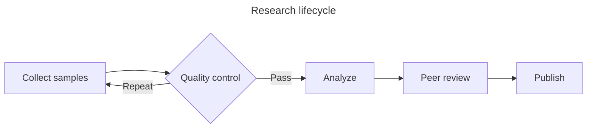

## Sequence

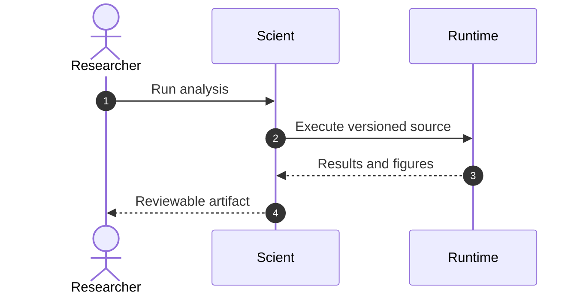

## State lifecycle

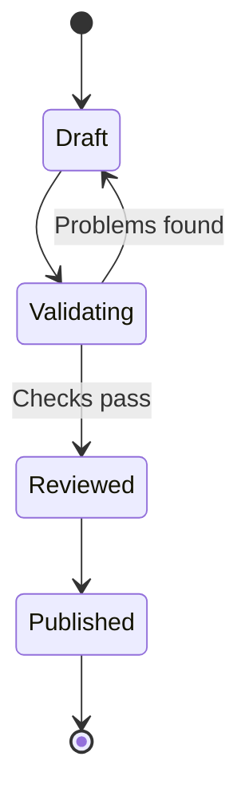

## Entity relationship

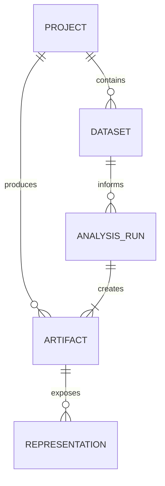

## Mindmap

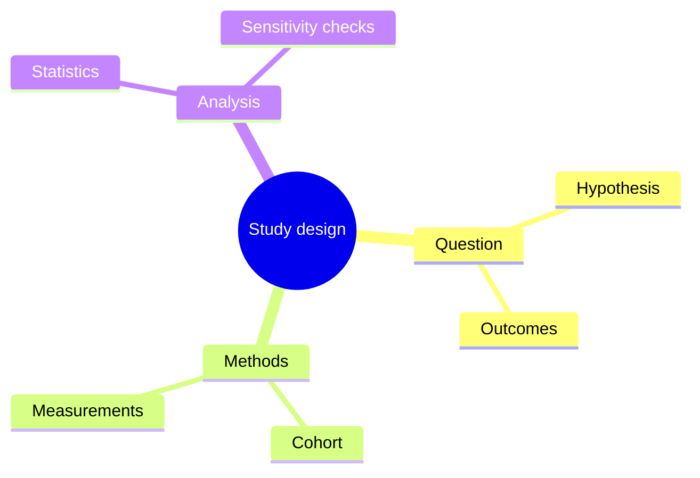

## Architecture

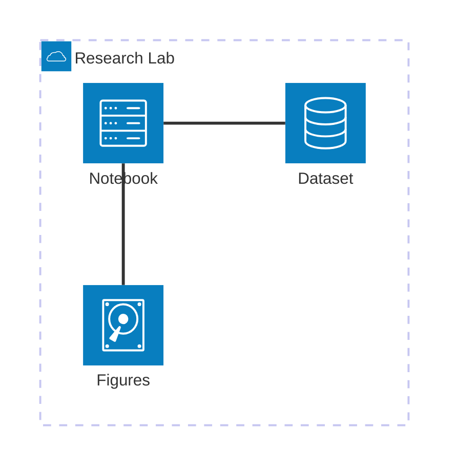

## Gantt

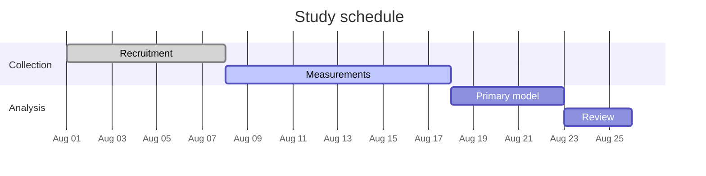

## Timeline

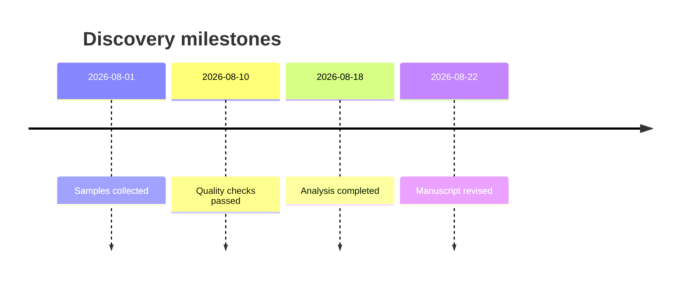

## Math labels

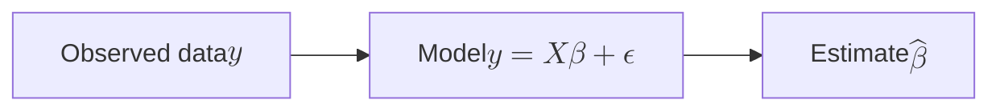

## Unicode and RTL labels

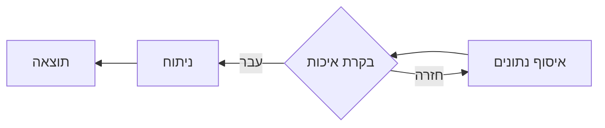

## Tall, narrow RTL flowchart

This diagram should keep its intrinsic width and remain centered when the chat
is wider. It should shrink, without horizontal clipping, when the chat becomes
narrower than the diagram.

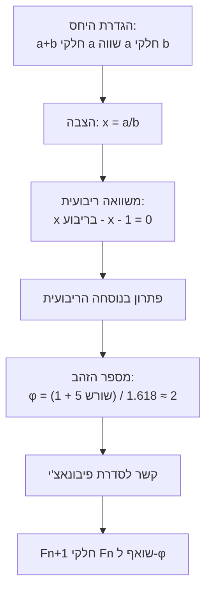

## Two adjacent diagrams

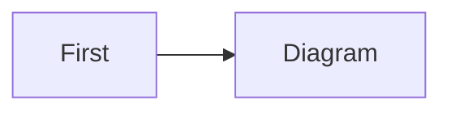

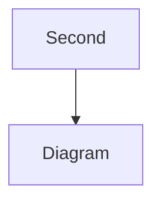

## Deliberately malformed source

```mermaid
flowchart LR
  A[Unclosed label --> B
```

## Deliberately empty source

```mermaid

```
