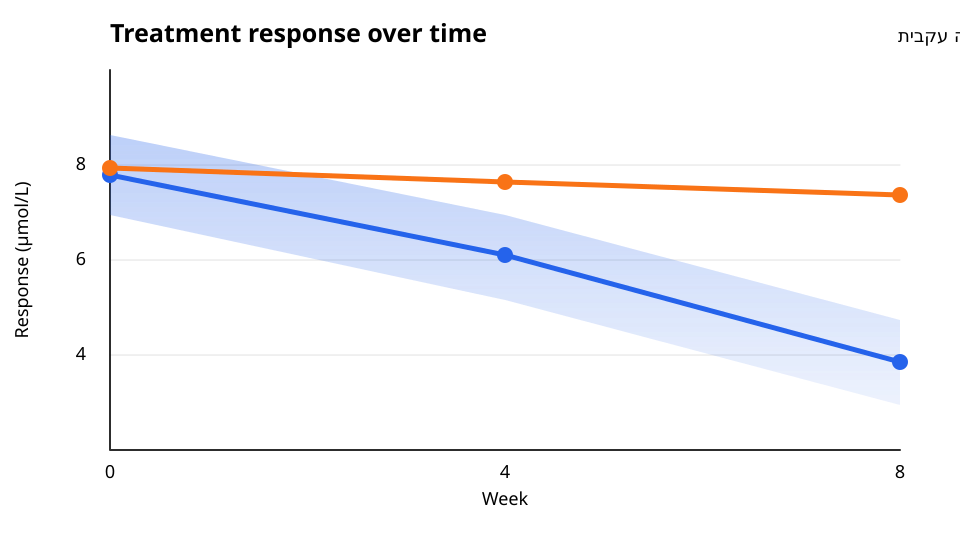

# Scient inline image fixtures

Open this file in Scient's Markdown preview and also paste the image sections
into a project chat. Review both light and dark appearance.

For each working image, confirm the top-right controls, title/format/path in
**More image actions**, background cycle, expansion, pinch or Control-scroll zoom, open-file action, copy,
original download, and refresh. Whole-message copy must preserve Markdown
rather than an authorized asset URL.

There should be no permanent header or path footer. The loaded surface should
fit the image, with no stretched image or large added margins. Check narrow
panels, keyboard focus, and touch: actions must not depend on hovering.

Drag the grip to each edge; it should stay inside the image without opening
the expanded viewer. Resize the panel after moving the toolbar, then click
the grip or press Home to restore the exact default position. Check arrow
keys, Shift for precision, and Escape during dragging. The action buttons
must still work normally and must not start a drag.

While each image is expanded, repeat open file, copy image, original download,
copy relative path, background cycling, and refresh from the expanded toolbar.
The action feedback must appear inside the dialog without resetting zoom.

## Transparent scientific SVG

The axes, confidence region, Unicode unit, and Hebrew annotation must remain
crisp at maximum zoom. Cycle the card background through automatic, light, and
dark.

## PNG control

This existing project PNG verifies raster loading and original-byte download.

## Encoded space

The destination uses an encoded space but must open the correctly named source
file.

## Missing image recovery

This file deliberately does not exist. The card must show a contained recovery
state with Try again and Open file, without breaking the surrounding document.

<!-- markdown-link-check: ignore-next-line -->

Text after the missing image must remain visible.

## Ordinary remote image fallback

The workspace renderer must not claim this URL. Network availability may
determine whether React Markdown's ordinary image renders.

