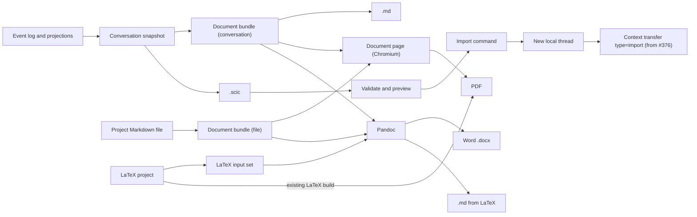
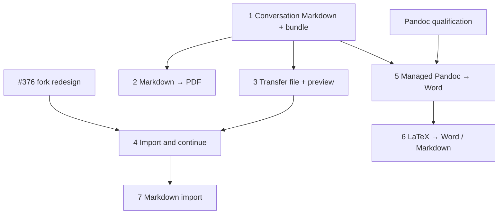

# Scient conversation export, document conversion, and portable import proposal

> **Status: ACCEPTED FOR IMPLEMENTATION (2026-09-28).** The owner approved starting implementation.
> Details may still be refined during implementation; the owner's decisions are listed in
> [Decisions](#decisions). Nothing here describes released behavior yet.
>
> Checked against `origin/main` at `a219441905` (2026-09-28). The fork redesign (#376) is merged on
> `main` (merge commit `12437d152e`).

## What this proposal covers

Four related capabilities:

1. **Export a conversation as a readable document** — Markdown, PDF, or Word — to keep or send to
   someone.
2. **Convert any document** — any project Markdown file to PDF or Word, and LaTeX projects to Word
   (and possibly Markdown). Conversation export uses the same machinery.
3. **Move a conversation to another Scient** — export a `.scic` file that another
   installation (or another person) can import as a new thread and continue. Markdown exported by
   Scient can also be imported, as text only.
4. **Share** — deliver any of those files. Save and Copy ship with the first export; a system share
   sheet follows; cloud links are a separate product.

## Summary of the recommendation

- A conversation becomes a **document bundle** on the server, from its saved history. From there it
  shares the same writers as a project Markdown file. There is one PDF path and one Word path, not a
  conversation-specific copy of each.
- **PDF uses Scient's existing controlled Chromium renderer.** It already produces tagged PDFs with a
  document outline and already renders Scient's math, diagrams, code, and right-to-left text.
- **Word and LaTeX conversion: Pandoc, installed as a managed tool** (pinned, downloaded on first
  use, run as a separate program under Pandoc's sandbox), as Scient already does for TinyTeX. Pandoc
  is fully open source (GPL) and costs nothing; a qualified licensing review and a source-delivery plan
  are a release gate. No permissively licensed
  base reaches its quality for editable equations, bibliographies, or LaTeX input. It sits behind a
  replaceable adapter. Decided by the owner.
- **Import builds on the second half of the fork system.** A fork (a) copies history into a new
  thread and (b) delivers that history to a fresh provider session. Import replaces (a) with
  "materialize a validated file" and builds on (b) — the context-transfer model from the fork redesign (#376, on `main`) —
  **extended** for a thread with no local source thread. That extension is required PR 4 work.
- **Core: four PRs.** Conversation Markdown; global Markdown→PDF; portable file with import preview;
  import and continue. **Conversion track alongside:** Pandoc qualification, then Word export, then
  LaTeX conversion.
- **One short transfer file, `.scic`** (a ZIP), carries a faithful copy of the conversation's supported
  history and included attachments. The recipient continues it **in a fresh session with their own
  provider** — a semantic continuation, not a restoration of the sender's session. Scient-exported
  Markdown imports as text only; any other Markdown starts a new conversation with the document
  attached, rather than a guessed transcript.
- **Exports are clean by default, including `.scic`.** Work log and reasoning are off unless turned on; every format
  offers both options.

## Product vocabulary

| Term                    | Meaning                                                                                                            |
| ----------------------- | ------------------------------------------------------------------------------------------------------------------ |
| **Export**              | Produce a human-readable file: Markdown, PDF, Word. Not re-importable as a conversation.                           |
| **Convert**             | Turn one document format into another: Markdown→PDF, Markdown→Word, LaTeX→Word.                                    |
| **Transfer**            | Produce a `.scic` file another Scient can import and continue.                                                     |
| **Share**               | Deliver a produced file: Save, Copy, system share sheet. Cloud links are a separate product.                       |
| **Import and continue** | Validate a transfer file, create a new independent thread, and start a fresh provider session on the next message. |

## First principles

1. **The conversation lives in Scient's event log.** Every export is a view of a server-side
   snapshot taken at a known point, never of the chat timeline, which is virtualized and only loads
   part of a long conversation.
2. **Render once, in the engine that already renders Scient.** Math (KaTeX), Mermaid, code, and
   right-to-left text already render correctly in Chromium. A PDF printed from a dedicated,
   complete document page will match what the user sees in Scient.
3. **Pass structure, not just text.** A bare Markdown string loses attachment bytes, image locations,
   citations, speaker boundaries, and provenance. The stages exchange a small document bundle so each
   output can choose the representation it supports.
4. **Import = fork from a snapshot you don't have locally.** Reuse the delivery half of forking; do not
   reuse fork boundaries, lineage, worktrees, or checkpoints.
5. **A transfer file is data, never authority.** No credentials, no provider session, no approvals, no
   tools, nothing executable, and every imported ID is new.
6. **Fidelity is reported, not promised.** Conversions from richer formats can lose content, and
   converters do not always warn when they do. Exports report what is known to be missing or
   unsupported, and qualification uses real documents. An absence of warnings is not proof of
   completeness.

## Current Scient foundations

| Foundation                                                                             | Where                                                                                                       | Use here                                                    |
| -------------------------------------------------------------------------------------- | ----------------------------------------------------------------------------------------------------------- | ----------------------------------------------------------- |
| Transactional per-thread snapshot with sequence watermark                              | [`ProjectionSnapshotQuery.ts`](../../apps/server/src/orchestration/Layers/ProjectionSnapshotQuery.ts)       | Basis of the conversation snapshot                          |
| All events of one command commit in one SQL transaction                                | [`OrchestrationEngine.ts`](../../apps/server/src/orchestration/Layers/OrchestrationEngine.ts)               | Import writes a whole thread atomically                     |
| Pending attachment uploads, swept when stale                                           | [`attachmentStore.ts`](../../apps/server/src/attachmentStore.ts)                                            | Import stages attachment files without a new recovery table |
| Controlled hidden-window renderer                                                      | [`ControlledHtmlPdfRenderer.ts`](../../apps/desktop/src/scient/documentExport/ControlledHtmlPdfRenderer.ts) | Prints the dedicated document page                          |
| `printToPDF` with tagged PDF and document outline                                      | [`BrowserPdfRenderer.ts`](../../apps/desktop/src/scient/documentExport/BrowserPdfRenderer.ts)               | PDF output                                                  |
| Immutable generated PDF revisions and reader                                           | [`GeneratedDocumentStore.ts`](../../apps/server/src/scient/documentArtifacts/GeneratedDocumentStore.ts)     | PDFs open in Scient's reader                                |
| Format-neutral native Save Copy from a signed asset                                    | [`AssetCopy.ts`](../../apps/desktop/src/scient/documentArtifacts/AssetCopy.ts)                              | Saving any exported file                                    |
| Chat Markdown rendering (react-markdown / remark / KaTeX / Mermaid)                    | [`ChatMarkdown.tsx`](../../apps/web/src/components/ChatMarkdown.tsx)                                        | Shared rendering for the document page                      |
| LaTeX build (latexmk / tectonic / managed TinyTeX)                                     | [`LatexBuildService.ts`](../../apps/server/src/scient/latex/LatexBuildService.ts)                           | LaTeX→PDF already exists; source for LaTeX conversions      |
| Managed toolchain install: pinned download, digest check, app-owned location (TinyTeX) | [`LatexManagedToolchain.ts`](../../apps/server/src/scient/latex/LatexManagedToolchain.ts)                   | Delivery pattern for Pandoc                                 |
| Narrow text-only history import for provider-session scanning                          | [`AgentSessionImporter.ts`](../../apps/server/src/project/AgentSessionImporter.ts)                          | Stays as is; not the portable importer                      |

From the fork redesign (#376, merged on `main`):

| Foundation                                                                                                               | Use here                                                                                                                                                                      |
| ------------------------------------------------------------------------------------------------------------------------ | ----------------------------------------------------------------------------------------------------------------------------------------------------------------------------- |
| `scient_context_transfers` / `scient_context_handoffs` with a `type` column (default `'fork'`) and `ForkContextDelivery` | Import continuation: an imported thread gets a transfer row with `type = 'import'`                                                                                            |
| Handoff history built from the **thread's own local** messages, activities, and plans                                    | Works for imported history once imports are modelled (PR 4)                                                                                                                   |
| Budgeted handoff, retry-safe delivery, evidence-based confirmation                                                       | No new bootstrap logic for import                                                                                                                                             |
| `t3_thread_read` MCP tool                                                                                                | The agent can read imported history the handoff had to omit                                                                                                                   |
| `forkActivityCopy.ts`: which activity kinds a fork copies, and size bounding                                             | Reference only. It bounds size but does not sanitize content, and it is not on `main`; exports use their own projection (see [Conversation snapshot](#conversation-snapshot)) |

What does **not** exist today: any conversation export, any Markdown→PDF path, any Word output, any
LaTeX↔Markdown conversion, Pandoc, or a portable conversation importer. PR #353's LaTeX Write view
parses LaTeX for editing; it is not a converter.

## Architecture



### Conversation snapshot

One versioned model, `ConversationSnapshotV1`, produced by a server service that reads in a single
transaction at a recorded thread sequence. It contains:

- thread metadata (title, dates, source provider/model as information only);
- all completed messages with roles, timestamps, turn grouping, Markdown text, and attachment
  descriptors;
- proposed plans and question/answer interactions;
- the work log, through a typed **export projection** (below);
- reasoning: the provider's reasoning text that chat shows in its collapsed reasoning blocks (stored
  as messages with the `reasoning` role, separate from the answer), kept separate so it can be
  included or excluded by policy. Only what Scient received and displays; nothing is reconstructed;
- provenance (fork/import origin);
- whether an in-progress turn was omitted;
- typed warnings for anything unavailable or unsupported; and
- a content digest.

**Export projection for the work log.** Each supported activity kind maps to an explicit, typed set of
display fields — for example tool name, status, title or command summary, and bounded output text.
Arbitrary provider payload objects are never serialized. Nothing executable (approval requests,
unanswered questions) is included. Size bounding (head and tail of long text, item limits) uses small
neutral utilities that PR 1 adds; the fork copy can adopt them later. The export projection does not
reuse the fork copy policy, because that policy bounds size without sanitizing content.

What Scient guarantees, and what it cannot:

- **Guaranteed:** Scient never exports its own credential stores, provider-native session identifiers,
  bearer tokens, internal metadata, raw provider payloads, or its own absolute storage paths.
- **Not guaranteed:** that text written by the user or the agent, or displayed tool output, contains no
  secrets or private paths. That content is exported as shown when the user includes it, which is why
  the work log is opt-in and the dialog warns.

There is one snapshot model, not separate archive and presentation models: renderers are
functions of the snapshot, so a renderer change cannot invalidate transfer files, and the transfer
file is the snapshot serialized with its attachments.

If a turn is running, the snapshot stops at the last completed turn and says so. A "wait until it
finishes" action can be offered.

The service must be tested on conversations with more than 2,000 messages.

### Document bundle

The shared input to every readable-output writer. Deliberately small — a few fields, not a document
framework:

```ts
type DocumentBundle = {
  markdown: string; // Scient-dialect Markdown
  metadata: {
    title: string;
    language?: string;
    direction?: "ltr" | "rtl" | "auto";
    createdAt?: string;
    source: DocumentSourceRef; // conversation snapshot digest, or file path + revision
  };
  assets: DocumentAsset[]; // resolved bytes: images, attachments, rendered diagrams
  citations: DocumentCitation[]; // see below
  warnings: DocumentWarning[]; // missing, unavailable, unsupported
};
```

Preparation keeps source forms and adds derived assets rather than replacing one with the other:

- **Mermaid** stays as a fenced block for Markdown output; its rendered image is added as an asset
  for Word. The browser renders it in a frame that cannot fetch anything; a diagram that needs an
  outside resource, or fails to render, appears in Word as its labelled source with a warning, and
  the export continues.
- **Math** stays as TeX, so the PDF page renders it with KaTeX and Pandoc can produce editable Word
  equations.
- **Images and attachments** are resolved to bundle assets with explicit paths; references that only
  work inside the originating installation are rewritten or marked unavailable.
- **Citations** come in two kinds:
  - In conversations, Scient's citations are mostly excerpts of project files ("cite selected text").
    They export as a quotation plus the file they came from.
  - Bibliographic citations (keys and references) mainly appear in Markdown files and LaTeX projects.
    They are preserved as citations, not flattened into plain links, so Pandoc can format them.

A conversation becomes a bundle by writing each message under a speaker heading with its timestamp,
optional collapsed work log, and attachment list. A project Markdown file becomes a bundle by reading
the saved file at a verified revision and resolving its relative resources.

**Chat and document Markdown are not the same dialect.** Chat decides per assistant message whether
single line breaks are kept (`shouldPreserveAssistantLineBreaks` in `MessagesTimeline.tsx` selects the
`remark-breaks` plugin set in `ChatMarkdown.tsx`); an authored Markdown file follows normal Markdown,
where a single line break joins lines. The conversation adapter must apply the chat's decision per
message and write explicit hard breaks where chat shows them. Otherwise the PDF and Word outputs would
silently merge lines that the user saw separated. The shared rendering module therefore exposes
explicit **chat** and **document** profiles rather than one plugin list, and the document page never
inherits interactive chat behavior (citation chips, file links, hover previews) merely by sharing
components.

**Supported Markdown profiles.** "Any Markdown file" means a file written in Scient's **document
profile**: CommonMark with GitHub tables, task lists, and alerts; `$…$`/`$$…$$` math; fenced code; and
Mermaid fences. Conversation bodies use the **chat profile** (the same plus chat's per-message line
breaks). Both profiles are documented and tested; constructs outside them (raw HTML beyond a safe
subset, Scient-only chips, other diagram languages) are reported as warnings, not silently guessed.
Pandoc does not share Scient's parser, so preparation translates each profile into Pandoc's Markdown
explicitly, and qualification compares the two outputs.

**Capture, then release.** The snapshot and the asset bytes (or verified immutable references) are
captured in one bounded read; the database transaction is released before any rendering or conversion
starts, so a slow export cannot hold the database or see files change midway.

### PDF: the document page

A dedicated route in the web app renders a document bundle as one complete, non-virtualized page,
using the same Markdown components as chat in a print mode. The existing controlled renderer loads it
in a hidden, isolated window and prints it.

Requirements:

- **Readiness check before printing.** The page reports document kind, source digest, block counts,
  unresolved resources, and whether fonts, math, diagrams, and images have finished. The desktop
  refuses to print on a mismatch or fatal error. A PDF can be structurally valid and still contain the
  wrong or half-rendered page.
- **Print stylesheet.** Typography, margins, title, page numbers, and running header via CSS `@page`
  margin boxes, which Chromium supports from version 131 (Scient is on Electron 44). This removes the
  need for Paged.js. It does not cover every advanced publishing feature; advanced running headers
  are out of scope.
- **Page-break rules that allow splitting.** The page's own stylesheet owns every break rule; the
  desktop adds none. Headings and a details block's summary line keep with what follows; figures,
  short code blocks, table rows, alerts, and images stay whole. Long code blocks, tables, quotes,
  work logs, and reasoning break across pages; a blanket keep-together rule causes overflow and large
  blank areas.
- **Front matter is metadata.** A YAML (`---`) or TOML (`+++`) block at the start of a Markdown file
  never prints; its `title`, when present, is the PDF's title.
- **Accessibility is qualified, not assumed.** Tagged PDF and outline generation are enabled, but
  correct reading order and bookmarks depend on the generated page and must be checked on real
  documents.
- No network access, navigation, popups, or arbitrary scripts in the render window. Workspace images
  resolve through approved assets.
- Output goes through the existing generated-PDF store and is saved through the same Save dialog as
  every other format; the notice's Open shows it in Scient's reader for the conversation or project
  it came from.
- The existing bounded PDF byte transport is reused: **64 MiB per PDF**
  (`BROWSER_PDF_EXPORT_MAX_BYTES` in `packages/contracts/src/browserPdfExport.ts`). A larger export fails
  with a clear message suggesting leaving out the work log and reasoning, or exporting the
  conversation as Markdown. A streaming transport is added only
  if measured real conversations need more.
- **Failure versus limitation.** An execution failure stops publication: the render did not finish,
  a required font or the page itself is wrong, the source changed. A known content limitation does
  not: an unavailable attachment, or a captured image that was served but cannot be decoded, becomes
  a clearly labelled placeholder, listed in the export's warnings, and the user can accept that
  output. A captured image that was not served, was blocked, or does not match the capture stays an
  execution failure. Failing on every warning would make ordinary sharing brittle.

**Host availability.** The PDF renderer is a Scient **desktop** capability. The existing HTML→PDF tool
already reports "A current connected Scient desktop is required to build this PDF" when no desktop is
attached (`apps/server/src/mcp/toolkits/documents/handlers.ts`). Scient's server can also be used from
a browser client or a remote machine with no desktop connected. The export service therefore
advertises which conversions are available on the current host:

| Output                             | Runs in          | Available without a connected desktop     |
| ---------------------------------- | ---------------- | ----------------------------------------- |
| Markdown, Scient conversation file | Server           | Yes                                       |
| Word (Pandoc)                      | Server worker    | Yes                                       |
| PDF                                | Desktop renderer | No — shown as unavailable with the reason |

A headless Chromium worker on the server could lift this later if browser-only or unattended use
needs PDF. It is not needed now and would mean shipping a second Chromium.

Why Chromium rather than LaTeX, Typst, WeasyPrint, or Paged.js: the output then matches how Scient
renders the same content, and the engine is already shipped and hardened. LaTeX-quality typography
remains available through Scient's existing LaTeX workflow for documents written in LaTeX.

### Word and LaTeX conversion: engine decision

**Recommendation: Pandoc, installed as a Scient managed tool** — a pinned official release,
downloaded on first use, verified against a known digest, and run as a separate program — exactly as
Scient already installs TinyTeX for LaTeX (`LatexManagedToolchain.ts`). Scient owns everything around
it: preparation of the input, the Word styles, the options, diagnostics, and delivery. Decided by
the owner, including delivery: **download on first use**, with an "Install now" button in Settings.

The owner's criteria: highest quality first; prefer fully open-source components; build our own if we
can own something of high quality; use Pandoc if there is no better choice.

#### Pandoc is fully open source

Pandoc is free, open-source software under the GPL (version 2 or later). "Open source" is not the
question; the question is what its **copyleft** licence asks of Scient. Nothing needs to be obtained
or paid for:

- **Cost:** none. There is no licence to buy, apply for, or sign. The GPL grants permission
  automatically to anyone who receives the program.
- **Typical obligations when a program distributes Pandoc:** include Pandoc's licence and copyright
  notice; make the exact corresponding source available; do not restrict users' rights to Pandoc
  itself. Scient already records notices in `third-party-licenses.config.json`. The precise
  obligations depend on how Scient delivers the binary (downloaded from upstream on first use,
  mirrored, or bundled) and on the exact release, so they are confirmed in the release gate below
  rather than assumed here.
- **When the obligations grow:** if Pandoc's code were combined into Scient's own program (compiled
  in, or loaded as a module in Scient's process), the combined program would have to be
  distributable under the GPL. Scient Desktop is public and MIT-licensed, and MIT code may be
  combined with GPL code, but this would constrain any future closed-source distribution. Running
  Pandoc as a **separate program** that exchanges documents with Scient keeps the two independent.
  The GNU FAQ notes that this depends on how the programs communicate and what they exchange;
  exchanging document files through a command-line interface is the standard arrangement.
- **If Scient downloads Pandoc on first use** from the official release, as it does TinyTeX, Scient
  does not ship Pandoc in its installer; it still records the notice and the matching source link.
  The licence list carries Pandoc's `COPYRIGHT` and GPL text for the pinned release, and Settings ▸
  Word export shows "Pandoc 3.11 · GPL-2.0-or-later · Source code", linking that release's exact
  source archive.
- **Release gate:** before the first release that installs Pandoc, a qualified licensing review of the
  exact delivery arrangement and a written source-delivery plan (which release, where its source is
  offered, how notices reach the user).
- **Precedents:** Quarto, an MIT-licensed open-source publishing system, ships Pandoc alongside its
  own code and lists it as a licensing exception; Zettlr and RStudio also ship Pandoc; Scient itself
  already installs GPL-licensed TinyTeX.

This arrangement is well trodden, but the precedents inform the review; they do not replace it.

#### Can Scient build its own converter instead?

The work divides into four problems. Open-source building blocks exist for some of them, not all:

| Problem                                                               | Best open-source base                                                             | Licence          | State                                                                                                                                                                      | What remains for Scient                                                                                                                                             |
| --------------------------------------------------------------------- | --------------------------------------------------------------------------------- | ---------------- | -------------------------------------------------------------------------------------------------------------------------------------------------------------------------- | ------------------------------------------------------------------------------------------------------------------------------------------------------------------- |
| Writing `.docx` files (text, headings, lists, tables, images, styles) | `docx` (dolanmiu)                                                                 | MIT              | Mature, active                                                                                                                                                             | Moderate: map Scient's Markdown tree to Word structures. Achievable at high quality.                                                                                |
| **Editable Word equations** (TeX → Word's OMML)                       | KaTeX or Temml give TeX → MathML (MIT). MathML → OMML: `mathml2omml` (JavaScript) | LGPL-3.0         | Small projects; the MIT Python alternative is unmaintained since 2019. The `docx` library's matrix and aligned-equation support is still an unmerged pull request (#3553). | **Hard.** A permissively licensed, high-coverage TeX → OMML converter would have to be written by Scient. This is the core of scientific Word quality.              |
| **Bibliographies** (citation styles)                                  | `citeproc-js` via `citation-js`                                                   | CPAL-1.0 or AGPL | Mature                                                                                                                                                                     | Licence is stronger copyleft than Pandoc's; otherwise a full CSL processor to write.                                                                                |
| **Reading LaTeX**                                                     | `unified-latex` (LaTeX parser)                                                    | MIT              | Active                                                                                                                                                                     | **Very hard.** Parsing is available; interpreting LaTeX (macros, packages, `\input`, environments, cross-references) is a long tail that Pandoc has spent years on. |

Other existing converters considered:

- **LibreOffice** (MPL-2.0) converts to Word and handles equations, but adds several hundred megabytes
  and a headless office suite. Its output for Markdown sources is not better than Pandoc's.
- **TypeScript Markdown→Word libraries** (`mdast2docx`, `@mohtasham/md-to-docx`) document narrow
  equation support: no matrices, aligned equations, accents, or indexed roots.
- **Microsoft's MathML→OMML stylesheet** ships with Office and cannot be redistributed.

**Learning from Pandoc's code:** reading it to understand behaviour is fine. Translating or porting
its code (for example its TeX→OMML module, `texmath`, GPL-2.0) into Scient would make that part a
derivative work under the GPL. An owned permissive converter must be written from specifications,
documentation, and observed output, not ported.

**Assessment.** An owned Markdown→Word writer for text, tables, and images is achievable at high
quality. Editable equations, bibliographies, and especially LaTeX input are where quality is won or
lost, and there is no permissive base that reaches Pandoc's level. Building them would be a
multi-month project with a long tail, and LaTeX→Word would still lag Pandoc for a long time.

#### Options compared

| Option                                        | Quality                                                          | Open source      | Effort | Size                                     | Notes                                                                  |
| --------------------------------------------- | ---------------------------------------------------------------- | ---------------- | ------ | ---------------------------------------- | ---------------------------------------------------------------------- |
| **Pandoc, managed tool (recommended)**        | Highest available                                                | Yes (GPL)        | Low    | None in installer; download on first use | Separate program; same pattern as TinyTeX.                             |
| Pandoc, bundled native executable             | Highest available                                                | Yes (GPL)        | Low    | Tens of MB per platform                  | Works offline from first launch; per-platform signing.                 |
| Pandoc WASM in Scient's server                | Highest available                                                | Yes (GPL)        | Low    | About 58.6 MB                            | In-process module: the arrangement with the stronger GPL implications. |
| Own writer on `docx` + own equation converter | High for text; equations only as good as what we build           | Yes (MIT)        | High   | Small                                    | No LaTeX input and no bibliographies without further large work.       |
| Own writer + `mathml2omml`                    | High for text; equation coverage limited by a small LGPL project | Yes (MIT + LGPL) | Medium | Small                                    | Same gaps for LaTeX and bibliographies.                                |

A managed download needs a network connection the first time Word export is used; an offline machine
gets a clear message. If first-use-offline matters, the bundled executable is the alternative with
the same licensing position.

#### Integration rules

- **Markdown and conversations:** the document bundle is written as Pandoc-compatible Markdown, with
  assets supplied as explicit resources. Scient's dialect extensions are handled in preparation, not
  left for Pandoc to guess.
- **LaTeX:** the LaTeX project goes **directly** to Pandoc's LaTeX reader, not through Markdown. The
  input is the selected root `.tex` file plus the included files, figures, and bibliography it needs.
  Converting a single `.tex` string is not sufficient for real papers.
- **Isolation:** see [Isolation and security](#isolation-and-security); a process boundary alone is
  not a sandbox.
- **Reporting:** Pandoc's warnings are collected and shown. The report says "Pandoc reported these
  problems", not "everything that was lost", because loss is not always detected.
- **Closed options:** the adapter owns Pandoc's options, templates, and resource list. Export requests
  choose from Scient's supported routes; they never pass arbitrary Pandoc flags.
- **One engine:** Scient ships one default Word engine, not two with subtly different behaviour.
- **Replaceable:** Pandoc sits behind an adapter. If Scient later builds an owned converter that
  matches it on the qualification documents, it can replace Pandoc without changing sources,
  bundles, or the user interface.

**Before adopting:** qualify Pandoc's output on the fixture set (see the conversion track) in Word,
Google Docs, and LibreOffice. If a gap appears, first try a preparation rule or a style change;
consider an owned component only on evidence that Pandoc cannot meet the requirement.

#### Isolation and security

A separate process with time and memory limits is **not** a sandbox. Pandoc's own "A note on security"
warns that untrusted input can disclose local files: LaTeX (and other formats') `include` directives
read files, and Word output embeds images, which an attacker can point at non-image files. Its
`--sandbox` option limits readers and writers to the files named on the command line and blocks these
attacks, **but it also prevents including images in Word output**, and it does not cover filters or
PDF engines. Conversation input can come from an imported `.scic` written by someone else, so every
conversion treats its input as untrusted.

What Pandoc's source shows about the command-line sandbox (`src/Text/Pandoc/App/OutputSettings.hs`,
`sandbox'`, checked 2026-09-28):

- Files readable inside the sandbox: the **reference document**, the **CSL style**, **citation
  abbreviations**, and **bibliography files** (plus EPUB-only inputs). So Scient's Word template and
  built-in citation processing (`--citeproc`, which is not a filter) work under `--sandbox`.
- **Images and LaTeX `\input` files are not readable.** Images can still be supplied inline as `data:`
  URIs, which Pandoc resolves without file access.
- Under `--sandbox`, Pandoc skips its automatic PNG fallbacks for SVG images in Word output, so Scient
  supplies PNG renderings of diagrams itself.

**Candidate design to qualify** — not yet an implementation contract: Scient resolves every resource,
and Pandoc never reads the file system.

1. **Read, sandboxed:** Pandoc converts the prepared input to its JSON document tree.
2. **Resolve, in Scient:** Scient replaces each image reference with an inline `data:` URI, reading only
   files in the source's allowlist (the document bundle's assets, or files inside the LaTeX project
   root). Anything else becomes a labelled placeholder and a warning. Project files (images, LaTeX
   includes, bibliographies) are read through a handle bound to the file the path check saw, so a
   file swapped for a link out of the project after that check is refused. On Windows, which has
   no such read, a LaTeX export reads only the editor's file at its saved revision and is refused
   when it needs any other project file.
3. **Write, sandboxed:** Pandoc writes the Word file from the resolved tree, with Scient's reference
   document, CSL style, and bibliography named on the command line.

**LaTeX `\input` and `\include` need a decision in qualification.** Two candidate strategies:

| Strategy                                   | How                                                                                                                                                                                                                                     | Risk                                                                                                                                                                                                                   |
| ------------------------------------------ | --------------------------------------------------------------------------------------------------------------------------------------------------------------------------------------------------------------------------------------- | ---------------------------------------------------------------------------------------------------------------------------------------------------------------------------------------------------------------------- |
| **Structural include resolution**          | Parse the project with a real LaTeX parser (`unified-latex`, MIT) and splice only `\input`, `\include`, and `\subfile` targets that resolve inside the project root, respecting comments and verbatim environments. No macro expansion. | Must not grow into a second LaTeX interpreter; unusual include patterns stay unresolved and are reported.                                                                                                              |
| **Pandoc WASM with an explicit file tree** | The WASM build receives exactly the project's files and cannot see anything else; Pandoc's manual lists WASM as a safe way to run untrusted input.                                                                                      | About 15 MB download; runs inside Scient's process, which has stronger GPL implications than a separate program (acceptable for MIT-licensed, public Scient, but it constrains any future closed-source distribution). |

An operating-system-level sandbox around the native process is a third option, but it is a separate
cross-platform engineering commitment, not a small fallback.

Further rules:

- Run in a fresh temporary working directory, with a minimal environment (no inherited home,
  configuration, or data directory), no network, and time, memory, and output-size limits with
  cancellation.
- Never use filters, custom writers, `--pdf-engine`, or user-supplied flags. Built-in `--citeproc` is
  allowed.
- Use a Pandoc build with **embedded data files** (the manual's `embed_data_files` recommendation), so
  the Word writer finds its defaults under `--sandbox`.
- Qualification proves the complete combination: images, the reference document, bibliography and CSL,
  nested LaTeX inputs, offline operation, rejected out-of-scope file access, and cancellation and
  limits.

#### Word styles

A Scient default style ships first, as a reference document that defines fonts, headings, code, tables,
captions, and equations. A small set of additional presets follows (for example a compact style and a
manuscript style); Pandoc's reference-document mechanism makes each preset a single `.docx` file.
User-supplied templates, such as a journal's, can come later through the same mechanism.

#### LaTeX conversion scope

With Pandoc, LaTeX→Word and LaTeX→Markdown use the same LaTeX reader with different writers, so
adding LaTeX→Markdown costs little beyond qualification. The first version delivers **LaTeX→Word**;
LaTeX→Markdown is added in the same step if its output passes qualification, and deferred otherwise.
Markdown→LaTeX comes later, on request.

### Markdown output

The `.md` export is clean, ordinary Markdown: title, compact metadata, speaker headings, original
message Markdown, attachment names with availability notes, optional work log and reasoning in
collapsible `<details>` blocks, and a warning section only when there are warnings. No Base64-embedded
files and no hidden JSON.

A single `.md` file cannot carry images. When a conversation or document has images or attachments,
the export offers two Markdown choices:

| Choice                                 | Contents                                                    | When to use                                |
| -------------------------------------- | ----------------------------------------------------------- | ------------------------------------------ |
| **Markdown (`.md`)**                   | Text only; attachments listed by name                       | Pasting, quoting, editing text             |
| **Markdown with attachments (`.zip`)** | `name.md` plus `attachments/`, referenced by relative paths | Keeping images in a portable Markdown form |

A `.zip` is one file to send, unlike a loose `.md` plus folder that people separate. The dialog also
points out that PDF and Word keep images inside a single file.

## What can be imported

Three kinds of input, one import pipeline:

| Input                                  | What the user gets                                                                                                                      | Fidelity                                                             |
| -------------------------------------- | --------------------------------------------------------------------------------------------------------------------------------------- | -------------------------------------------------------------------- |
| **Scient conversation file (`.scic`)** | The supported history as recorded: speakers, turns, timestamps, included attachments, plans, and the work log if the sender included it | **Faithful copy of supported records**; continued in a fresh session |
| **Markdown exported by Scient**        | The conversation's text: speakers, turns, timestamps; attachments listed by name                                                        | **Text only, unverified** — labelled as such                         |
| **Any other Markdown file**            | A new conversation that starts **with the document attached as context**, not a guessed transcript                                      | Not a conversation import                                            |

**What a `.scic` does not carry:** the sender's provider session, pending approvals or questions, a
turn that was still running, attachments that were unavailable at export, the sender's workspace
files, and anything the sender chose not to include. The preview lists what is missing.

Other tools' chat exports (ChatGPT, Claude, …) can be added later as further readers, one per source,
on demand.

**One pipeline.** Every reader produces the same `ConversationSnapshotV1` plus warnings; validation,
preview, the import command, provenance, and continuation are shared. Adding a source later means
writing one reader.

### Why not guess conversations from arbitrary Markdown

A normal Markdown file has no reliable speakers, turns, or timestamps. Guessing from headings would
misread ordinary documents and invent a history that never happened. Starting a conversation _about_
the document is the honest version of that import: the agent gets the full text, and nothing is
fabricated.

### Scient-exported Markdown is importable — by design

The Markdown writer follows a versioned format, **Scient conversation Markdown v1**, fixed in PR 1 so
every export from the first release can be imported once the reader lands.

```markdown
---
scient: conversation
scient-format: 1
scient-export: 7f3c9a2e41b8
title: Export and import design
exported: 2026-09-28T09:12:00Z
---

<!-- scient:message export=7f3c9a2e41b8 n=1 role=user time=2026-09-27T14:05:00Z -->

## You · 27 Sep 2026, 14:05

Please investigate …

<!-- scient:message export=7f3c9a2e41b8 n=2 role=assistant time=2026-09-27T14:06:10Z -->

## Assistant · 27 Sep 2026, 14:06

Here is what I found …
```

Rules:

- **Markers carry structure only, never a second copy of the content.** The text the reader imports is
  the text the user sees, so an edited file imports as edited and nothing can disagree.
- **Each export has its own random `scient-export` value**, declared in the front matter and repeated in
  every marker. The reader accepts only markers carrying that value. A conversation that quotes another
  export, or discusses this format — as this very conversation does — cannot create boundaries,
  because quoted markers carry a different value.
- **Markers are recognised only at the top level of the parsed Markdown** (an HTML comment block, not
  inside fenced or indented code, block quotes, lists, or HTML blocks). Detection uses the Markdown
  parser, never a text search.
- **Collision escaping:** if a message body contains the literal sequence `<!-- scient:` outside code,
  the writer escapes it so it cannot be read as a marker.
- **Per-message namespacing:** reference-link definitions, footnote labels, and explicit heading
  anchors are prefixed with the message number (`[^m2-1]`, `[m2-source]`) so two messages defining the
  same label cannot collide in one file; the reader removes the prefix. Rendering is unchanged.
- **Speaker headings are for people.** Boundaries come only from valid markers; the reader never
  infers boundaries from headings.
- **Malformed or edited markers** (unknown export value, missing or duplicate numbers, out-of-order
  numbers, unknown role) are shown in the preview with the affected range. The user can import the
  messages that parsed cleanly or import the whole file as a document. There is no automatic fallback.
  Each message number is checked against the number of the last message imported: a number no higher
  than it is out of order (or a duplicate) and its message is left out; a number that skips ahead is a
  gap, noted without leaving anything out. A message left out for another reason (role, time, marker)
  never moves that baseline, but still stands for a number, so the next one is not reported missing.
- A file without Scient's front matter is never parsed as a transcript; it is treated as a document
  ("start a conversation with this document").
- Imported Markdown history is labelled **"Imported from Markdown — unverified"** on the thread,
  because anyone could have edited the text.
- Adversarial fixtures from PR 1 onward: a conversation containing literal markers, quoted exports,
  speaker-like headings, duplicate reference and footnote labels, and this proposal's own discussion.

### Where it fits in Scient

Scient already has a **different** kind of import: adopting a local Claude Code, Codex, or Cursor
session found on disk and resuming that provider's own session (`AgentSessionImporter.ts`, through the
narrow `thread.history.import` command). That stays separate: it resumes a native session on the same
machine; a conversation file or Markdown import never does.

Evidence from comparable products: LibreChat and Open WebUI import their own structured exports and
ChatGPT's `conversations.json`; neither guesses conversations from Markdown. ChatGPT's export changed in
August 2026 from one `conversations.json` to many files and broke LibreChat's importer — a reason to
version Scient's own format explicitly and to treat third-party formats as optional readers.

## Portable conversation file

### Name and type

| Property    | Value                                                      |
| ----------- | ---------------------------------------------------------- |
| Extension   | **`.scic`** (Scient conversation)                          |
| Media type  | `application/vnd.scient.conversation+zip`                  |
| Container   | ZIP                                                        |
| First entry | `mimetype`, stored uncompressed, containing the media type |

Why `.scic`: short, and not in use by a known tool. `.sci` was rejected because Scilab — a scientific
computing tool whose users overlap with Scient's — uses it for scripts; `.scc` is a common subtitle
format.

The uncompressed `mimetype` first entry is the convention used by EPUB and OpenDocument: the file
identifies itself from its first bytes even if renamed, and Scient can reject a random ZIP before
reading further.

### Why ZIP

| Container        | Verdict   | Reason                                                                                                                                                                                                     |
| ---------------- | --------- | ---------------------------------------------------------------------------------------------------------------------------------------------------------------------------------------------------------- |
| **ZIP**          | **Adopt** | One file; attachments stored as real files at full size; read entry by entry without loading everything into memory; openable by any operating system; the same approach as `.docx`, `.xlsx`, and `.epub`. |
| Single JSON file | Reject    | Attachments must be Base64-encoded (about a third larger) and the whole file loaded into memory to read it.                                                                                                |
| SQLite database  | Reject    | Heavy for a message-and-files bundle, not inspectable without tools, and a larger parsing surface for untrusted input.                                                                                     |
| Tar              | Reject    | Must be read sequentially; not natively openable on Windows.                                                                                                                                               |
| Folder           | Reject    | Not one file; people separate the parts.                                                                                                                                                                   |

### Contents

```text
name.scic
  mimetype                      application/vnd.scient.conversation+zip (uncompressed, first)
  manifest.json
  conversation.json             ConversationSnapshotV1 — the only import authority
  conversation.md               readable copy for people without Scient
  attachments/<sha256>-<safe-name>
```

`manifest.json`: format and schema version, exporter version, export ID and time, conversation
digest, entry list with path, media type, size, and SHA-256, included and unavailable resources, and
warnings.

Hashes detect accidental corruption and inconsistent edits; they establish internal integrity, not
authenticity — anyone who edits the archive can recompute them. They do not prove who sent the file.
An imported `.scic` is therefore labelled **"Imported — unverified"** on the thread, like imported
Markdown. **Signing is deferred** until Scient has identities (accounts or trusted
keys): without them, a signature only says "signed by some key" and proves nothing.

### Implementation in the current architecture

- **Writing:** a streaming ZIP writer on the server. The server already depends on `yauzl` for
  reading ZIPs; its companion writer `yazl` (same author, MIT) is the natural addition.
- **Reading:** `yauzl` with the hardened options Scient already uses in
  `apps/server/src/provider/AntigravityInstallation.ts` (`lazyEntries`, `validateEntrySizes`,
  `strictFileNames`), plus the checks below.
- **Getting the file to the server:** the server may run on another machine than the client, and
  client file paths are not server paths. The import file therefore travels through the existing
  signed, streaming attachment upload (`apps/server/src/assets/AttachmentUpload.ts`), which writes to a
  pending location. Imports need their own size limit; the chat attachment limit (for example 50 MB)
  is too small for conversations with many attachments.
- **Opening a `.scic` by double-click:** the desktop build registers the file type (electron-builder
  `fileAssociations`; today only the `scient://` URL scheme is registered). The desktop receives the
  opened file (macOS `open-file` event; command-line argument on Windows and Linux), uploads it through
  the same path, and opens the import preview.
- **Share links later:** the existing `scient://` scheme can open a link that delivers the same `.scic`
  data into the same preview.

### Validation (before anything is written)

Reject:

- a missing or wrong `mimetype` entry;
- absolute or parent-traversing paths;
- symlinks and special files;
- duplicate and case-colliding paths;
- encrypted entries;
- too many entries, oversized entries, excessive total size, or excessive compression ratio;
- size or hash mismatches against the manifest, and undeclared extra files;
- unsupported major schema versions;
- more records than one import command writes (5,000 messages, work-log entries, and other items);
  and
- attachment content that contradicts its declared type or the allowed media policy.

Preview shows title, message and attachment counts, source provider/model, omissions, and warnings.

**Staging.** To be validated, the file must first reach the server (see
[Implementation in the current architecture](#implementation-in-the-current-architecture)), so preview
is not free of side effects: the upload is written to a dedicated **import staging area** with a
per-import size limit, a total quota, and expiry (removed when the user cancels, after import, and on a
timer and at startup otherwise). Preview makes **no durable change**: it creates no thread, copies no
attachment into a thread, and starts no provider.

## Import and continue

Import always creates a **new, independent thread**. It never merges into an existing thread, and it
never resumes the sender's provider session.

Sequence after the user confirms the preview and chooses a destination project and provider/model:

1. **Write the attempt journal.** A small JSON file in the import's staging area, written atomically and
   flushed to disk before anything is published. It records:
   - the attempt ID, the orchestration command ID, and the destination thread ID;
   - the complete source-to-destination mapping of message, turn, and attachment IDs;
   - the package's export ID and digest, and the chosen project and provider/model;
   - the exact final attachment paths this attempt will own.
2. **Publish attachments.** Copy each validated staged file to its final, destination-owned path
   **before** the commit, as a normal message send does (the command normalizer copies pending uploads
   to their final path; `apps/server/src/orchestration/Normalizer.ts`). Files are published before the
   history that references them, so a message never points at a missing attachment.
3. **Commit once.** Dispatch **one** new command, `thread.conversation.import`, with the journal's
   command ID. Its events — thread creation, imported history, and provenance — commit in one SQL
   transaction, and the orchestration engine records a command receipt
   (`orchestration_command_receipts`). The `type = 'import'` context-transfer row is written by a
   projection of the import event, the way #376's `lineageProjection.ts` writes a fork's transfer row;
   PR 4 confirms that this projection runs inside the same transaction.
4. **Finish.** Remove the staged upload and the journal.

**Retry.** A retry of the same attempt reuses the journal's identities. It first checks the command
receipt: if the command committed, it only finishes step 4; if not, it re-publishes any missing files
and dispatches the same command ID, which the engine treats idempotently. Importing the same file again
as a new attempt deliberately creates a second thread.

**Cleanup is based on commit receipts and ownership, never on whether a thread currently exists** (a
committed thread may later be deleted by the user):

- Receipt shows the command committed → the published files belong to the thread; never delete them.
  Only the staging area and journal are removed.
- No receipt, and the attempt was cancelled or expired → delete exactly the paths the journal lists,
  then the staging area.
- A failure after commit (for example, while responding to the client, or while removing staging
  files) never removes committed attachments.

This is a small file journal, not a new database subsystem; an import-state table and recovery
reactor are unnecessary: forks need a provisioning state machine because of worktrees
and checkpoints, and import has neither. Importing never starts an agent run by itself.

The existing `thread.history.import` command stays as it is for provider-session scanning. It is
text-only and was not built for this.

**First new message.** The context-delivery path builds a budgeted handoff from the imported thread's
own history and delivers it to a fresh session of the chosen provider. Omitted items stay visible in
Scient and readable by the agent through `t3_thread_read`. Old tool calls are history only and never
run again.

**Required PR 4 work on the #376 model.** #376 was designed for forks, which always have a local source
thread and a lineage row. An import has neither, so the model is extended explicitly:

- **Local source identity is nullable for imports.** `scient_context_transfers.source_thread_id` (today
  `NOT NULL`) becomes nullable, and is null for imports. External IDs never masquerade as local thread
  IDs.
- **External identity lives only in provenance:** the package's export ID, source thread ID, and digest.
- **Imported history is an inherited prefix, whatever the clocks say.** When a file's latest time is
  later than the import (the sender's clock was ahead), every imported time moves back by the same
  amount, so the latest equals the import time: order and spacing are kept, and every message sent
  afterwards shows after the imported history. The import origin records the move
  (`timesShiftedMs`, summed with earlier transfers' moves and kept through re-export), and the
  import notice says "Times are shown <duration> earlier than in the file, because the file's times
  were later than the moment it was imported." The continuation handoff also treats every record
  dated at or before the import as prior to the current message, even if that message is dated
  earlier.
- **Imported IDs keep the source order.** Records keep their source timestamps (moved back together
  only as above), and history is read
  back by timestamp, then ID. So the IDs of imported messages, reasoning, activities, plans, and turns
  are one random prefix per import followed by a zero-padded number in history order; records that
  share a timestamp read back, continue, and re-export in the order the file lists them.
- **A folded answer names its message.** Scient names a live answer's user message
  `async-answer:<request ID>`, and a file names it the same way. An imported folded answer's message
  gets an ordered ID like any other, so the imported answer names it (`messageId` on its
  `user-input.answer-submitted` payload); chat folds that message, a fork names its own copy, and
  export writes it back as `async-answer:<request ID>`.
- **Transfer type decides which operations are valid.** Fork-only paths — usage fallback to the source
  thread, native-fork planning (which joins lineage) — do not apply to `type = 'import'`.
- **Inherited-turn semantics are generalized, not bypassed.** #376 records a fork's inherited turns in
  lineage so that revert keeps them; imported turns are inherited history in the same sense (they have
  no checkpoints). The import records its imported turn IDs so that revert, refork, and projection
  code treat them exactly like inherited turns.
- **Acceptance scenarios:** import → continue; import → switch provider; import → fork; import → revert
  (where revert is supported); import → export again; plus the full #376 fork suite unchanged.
- Duration and memory of one import command with thousands of messages are measured.

#376 is merged on `main`, so PR 4 builds on `main` directly.

## Sharing

- **Save and Copy** ship with the first export PR. Saving a file is already enough to share it with
  anyone.
- **System share sheet:** a small follow-up over the same produced files.
- **Cloud links** are a separate product: accounts, access control, revocation, storage, and audit.
  If built, they should reuse the snapshot and transfer vocabulary but not use ZIP files as a sync
  protocol. The exploratory research is in
  [`scient-cloud-synchronization-and-collaboration-research.md`](../reports/scient-cloud-synchronization-and-collaboration-research.md)
  (local draft, not on `main`).

## User experience

### Entry points

- Thread menu (sidebar row and chat header) → **Export ▸** `Markdown (.md)…`, `PDF (.pdf)…`,
  `Word (.docx)…`, `Scient file (.scic)…`. Each entry opens the export dialog for that format. Every
  entry is always enabled; a format this host cannot produce says why inside its dialog.
- Thread menu → **Copy ▸ Conversation as Markdown** copies the whole conversation as text-only
  Markdown with the default options (no work log, no reasoning) and confirms with a toast.
- Markdown editor → More menu → **Export ▸ PDF / Word**.
- LaTeX workspace → **Export ▸ Word** (and Markdown, if it passes qualification).
- **File ▸ Import Conversation…** (and the sidebar's **Import conversation**), drag and drop onto
  Scient, or double-click a `.scic` file. Accepts `.scic` and `.md`; the preview says which kind of
  import it will be (faithful copy, text only, or "start a conversation with this document").
- One dropped `.scic` imports wherever it lands, ahead of the chat column's and composer's
  attachment drop and the sidebar rows' drop: the import drop target listens in the capture phase.
  Other files keep their owners, so a `.md` dropped on the chat still attaches; one dropped where
  nothing else takes it is imported. Browsers hide a dragged file's name until the drop, so the
  "Drop to import conversation" overlay is judged by the reported media type: shown outright for
  the `.scic` type, and with "Other files attach as usual" for a single file of unknown type
  (what macOS and most systems report for `.scic`). A drop on an open import dialog replaces its
  file, except while an import is committing, when it waits its turn.
- While first-run setup (`/welcome`) is showing, requests from every entry point are queued with a
  short notice and the dialog opens once setup is finished, like the other startup dialogs.

### The export dialog

One compact dialog per format, built from existing primitives (`dialog`, `switch`, `radio-group`,
`select`, `popover` in `apps/web/src/components/ui/`). The title names the format; there is no format
switcher. The Markdown dialog:

```text
┌ Export as Markdown ⓘ ───────────────────────────────────────────┐
│  Study                                                          │
│  ( ) Text only (.md)                                            │
│  ( ) With attachments (.zip)                                    │
│                                                                 │
│  Include  [ ] Work log — tools, commands, results               │
│           [ ] Reasoning — the thinking shown in chat            │
│           ⚠ May include file paths, commands and their output.  │
│                                                                 │
│  ⚠ The current turn is still running; it will be left out.      │
│                                        [ Cancel ]  [ Save .md ] │
└─────────────────────────────────────────────────────────────────┘
```

- The ⓘ next to the title opens a one- or two-sentence card about the format (accessible name
  "About <format> export"). Info buttons are used only where a choice needs one.
- The Markdown packaging choice appears only when the conversation has images or attachments.
- The primary button names what is saved: **Save .md** / **Save .zip**, **Save PDF**,
  **Save .docx**, **Save .scic**. There is no Copy button; copying lives in the thread menu.
- The caution line appears only while the work log or reasoning is on.
- Word without Pandoc shows, in place of the options, "Word export needs Pandoc (N MB, one-time
  download)." with **Install Pandoc** and inline progress; the install control is disabled while an
  export runs. Once Pandoc is installed the normal options appear, with no Pandoc mention. When Pandoc
  cannot run on this computer, the dialog gives the reason and has no Save button. Any other format
  this host cannot produce (PDF without a current Scient desktop) shows its reason and no Save button.
- Every export covers the whole conversation. Exporting up to a chosen message is deferred; the
  export request and snapshot already support it.
- Changing any option clears the last error. "Preparing the conversation…" and "Exporting…" are
  announced as status text.
- Warnings are one line each, and the same warnings are included in the exported file.
- **Up to selected message** exports exactly that message and everything before it, nothing after:
  ending at a prompt leaves out the work, reasoning, plans, and answers that followed it; ending at
  an answer keeps its turn's work log, reasoning, plans, and questions and answers recorded up to
  that answer; ending at a steering message leaves out the rest of the turn it interrupted.
  Attachments of messages and answers after it are neither listed nor read. The bound is applied
  once, to the snapshot, so every format carries the same content. This range is on hold: the
  server refuses it and the dialog exports the whole conversation, until records updated after the
  chosen message are also bounded.

### Work log and reasoning

**Decided by the owner:** both are **off by default**, and both can be turned on.

**Decided by the owner:** offer both options on every format, unless one format proves too
complicated, in which case only the formats where it is easy offer them. All formats are produced from
the same snapshot and document bundle, so the options are expected to cost the same everywhere. What
differs is only how each format shows them:

| Format              | How the work log and reasoning appear                                                            |
| ------------------- | ------------------------------------------------------------------------------------------------ |
| Markdown            | Collapsible `<details>` blocks under the message ("Work log · 12 steps", "Reasoning")            |
| PDF                 | Compact, indented, smaller grey blocks under the message, fully expanded (paper cannot collapse) |
| Word                | The same as PDF, using dedicated Word styles so they can be restyled or removed in Word          |
| Scient conversation | Structured data. Both **off** by default, as for every format                                    |

**Reasoning** means exactly the provider's reasoning text that chat displays in its collapsed reasoning
blocks — not a new explanation and not anything hidden from the user. Providers differ in what they
expose (some send summaries), and the export includes only what Scient received and shows.

**Why the work log is opt-in even for `.scic`:** it would help the recipient's agent, but bounded tool
output can still contain private paths, source code, environment details, or secrets, and a `.scic`
goes to another person. "Nothing executable" does not mean "safe to share". When either option is
turned on, the dialog shows the caution line under the toggles.

Long tool output is bounded to a head and tail by the export projection, with an "N lines omitted"
marker, so a single command cannot swamp a document. Nothing executable (approvals, questions awaiting
answers) is ever included.

Feasibility: the snapshot already needs the work log and reasoning for transfer files, and the chat
already groups them for display. The grouping logic lives in the web client
(`MessagesTimeline.logic.ts`); moving its pure part to a shared package lets the server group exactly as
chat does. The dialog uses existing UI primitives. The main work is the PDF and Word styling of these
blocks.

Options reset to their defaults each time, so sensitive content is never included because of an
earlier export.

### Conversation PDF and Word look

**Decided by the owner:** document style — a heading per speaker with clear speaker labels and
colours, full-width text — not chat bubbles. Detailed styling rules are a later discussion.

### Import

A file is sent and checked as soon as it arrives (drop, picker, or OS open); there is no separate
preview step. The dialog shows upload progress and then "Checking the file…" as status text, and
Cancel or Esc during either aborts the transfer and calls `cancel`, which releases the staged
import. Changing the file or the destination environment does the same and starts again.

- **Destination environment.** Listed by name through the same labelling as the branch toolbar
  (the local environment is "This device"), this device first; the row is hidden when only one
  environment is known. Availability is config membership and a live connection: a known
  environment keeps its cached config while disconnected, so its connection phase decides, and
  an environment that is not connected is listed but cannot be chosen. The first connected
  option is used only until a file is sent or the user picks one; from then the destination is
  fixed. If it disappears (removed or disabled), or its connection drops at any stage, the
  transfer is aborted, the staged import is cancelled as a best effort (unconfirmed imports also
  expire on the server), and the dialog asks for another destination. After a dropped
  connection it offers **Try again** once that destination reconnects; reconnecting alone never
  resends. The file is never sent to a destination the user did not choose.
- **Preview.** Server validation facts only, never message text: kind, pluralized counts, the
  source provider and model by display name, what the sender left out, and notes from the file.
  A plain Markdown document is titled "Start a conversation from this document" and confirmed
  with **Start conversation**; damaged transcript markers read "Some messages couldn't be read"
  and need a tick before the readable messages import, or can be re-staged as a document.
- **Project and model.** Chosen with the shared `Select`; the model defaults to what a new thread
  in that project would use (project default, then environment default, then the provider's own
  default) and is left for the user to choose when that model is not ready, never the first entry.
- **Permissions.** Imports always start with `runtimeMode: "approval-required"` (owner decision:
  unverified history starts supervised); the dialog states this in one line only when the
  project's default mode differs. The server enforces it: a confirm asking for another mode is not
  refused, but the thread starts supervised and the committed destination reports
  `approval-required`.
- **Failures.** A rejected file shows the server's message. Reason codes, entry paths and
  connection details are never shown; such a message falls back to plain text per reason. An
  OS-opened file is streamed by the desktop, which answers `declined` when the user declines its
  "Send conversation file?" prompt and `cancelled` when the renderer stopped that upload; both
  close the dialog without an error. `rejected` (the server refused the bytes) and the other
  desktop failures read as plain sentences. Each upload of an opened file is one attempt with its
  own `attemptId`. Changing the destination, "Try again", Cancel or Esc during such an upload
  first asks the desktop to stop that attempt (`cancelOpenedConversationFileUpload`, where
  available), then calls `cancel`; the attempt ends, or never starts if it was still waiting, and
  a later attempt sends the same file again. Closing the dialog, or replacing its file, gives the
  opened file up (`releaseOpenedConversationFile`): the desktop stops any upload of it and forgets
  its token.
- **Confirming.** Once the confirm is sent, the server may commit the import whatever happens to
  the connection (it runs the commit in its own scope), so the dialog keeps the staged import and
  its destination until the outcome is known and never cancels it. If the answer does not
  arrive, or the connection drops, the dialog says so ("Lost the connection while importing.
  Scient will check whether the import finished when the connection returns.") without the
  destination picker, and on reconnect re-sends the identical confirm. The server answers a
  repeated confirm idempotently: the committed result (the dialog then finishes as usual), the
  running attempt's outcome, or an error meaning nothing was imported. After such an error
  **Try again** confirms the same staged import; only when the server no longer has it
  (`import-not-found`, `cancelled`) does Try again send the file again. `already-imported` for the
  dialog's own import means it committed (to a destination other than this confirm's); the
  dialog then asks `cancel`, which answers a committed import with its result, and finishes with
  that thread, never sending the file again. The dialog calls preview only before confirming.
  Closing after a confirm that answered "not imported" still cancels the staged import, and if
  that cancel finds it committed after all, a toast says so.
- **Queueing.** A dropped file replaces the file of an import dialog only while one is on screen
  and not committing; otherwise, including during first-run setup, it waits its turn.

On success a toast says the next message continues the conversation with the chosen model, and
Scient opens the new thread. The imported thread shows where it came from ("Imported —
unverified"), what was omitted, and that the next message starts a fresh session.

### Agent access

A general `scient_document_export` tool for explicit project outputs (for example `notes/report.md`
→ `notes/report.pdf`), alongside the existing HTML-only `scient_pdf_build`, which stays unchanged.

## Delivery of produced files

- PDFs go through the existing generated-PDF store and are then saved with the same Save Copy path;
  the notice can open the stored PDF in the reader.
- Other outputs (`.md`, `.docx`, `.scic`) are written to a server-owned temporary
  export file, read through a signed asset, and saved with the existing Save Copy path. They are
  cleaned up after a short retention period and on startup.

No durable export store is needed: exports are one-off downloads, not versioned documents, so a
temporary file with a signed read is sufficient unless re-download history becomes a requirement.

## Pull request plan

### Program overview

The whole program is **seven PRs**: four core PRs, then three follow-ons, each labelled.

| Track                      | PRs                                                                                             |
| -------------------------- | ----------------------------------------------------------------------------------------------- |
| Core                       | 1 Conversation Markdown · 2 Markdown→PDF · 3 `.scic` export and preview · 4 Import and continue |
| Follow-on: Word            | 5 Managed Pandoc and Markdown/conversation → Word                                               |
| Follow-on: LaTeX           | 6 LaTeX project → Word (and → Markdown if it qualifies)                                         |
| Follow-on: Markdown import | 7 Markdown import                                                                               |

### Core: four PRs

| #   | PR                                                         | Depends on                    | Result                                                              |
| --- | ---------------------------------------------------------- | ----------------------------- | ------------------------------------------------------------------- |
| 1   | **Conversation → Markdown, snapshot, and document bundle** | —                             | Thread menu → Export ▸ Markdown with Save and Copy                  |
| 2   | **Global Markdown → PDF**                                  | 1 (for the conversation half) | Any `.md` file, and any thread, → PDF in Scient's reader            |
| 3   | **Portable conversation file and import preview**          | 1                             | Export `.scic`; opening one previews it without changing anything   |
| 4   | **Import and continue**                                    | 3 (#376 is on `main`)         | A new independent thread that continues in a fresh provider session |

Follow-on after the core: **PR 7 — Markdown import** (depends on 1 and 4).

**PR 1** — `ConversationSnapshotV1` service; typed work-log export projection and neutral
size-bounding utilities; Scient conversation Markdown v1 (per-export marker
value, parser-level marker detection, escaping, per-message label namespacing);
shared work-log grouping (moved from `MessagesTimeline.logic.ts`); `DocumentBundle`; Markdown writer,
including Markdown with attachments (`.zip`); the export dialog with work-log and reasoning options;
temporary export file plus signed-asset Save; Copy; thread menu entry. Tests: determinism, more than
2,000 messages, running-turn omission, chat line breaks preserved, message markers and front matter
present (so later Markdown import works on every export), no credentials, native IDs, or
absolute paths in output, and no work log or reasoning unless selected; the adversarial Markdown
fixtures listed under [Scient-exported Markdown](#scient-exported-markdown-is-importable--by-design).

**PR 2** — document page route with shared Markdown components in print mode; print stylesheet and
page-break rules; readiness check with fail-closed printing; Markdown editor save-flush and verified
source revision; generated-PDF publication; editor action; thread export; `scient_document_export`
tool. Tests: rendered-page review of a fixture set (long code and tables across pages, math, Mermaid,
images and missing images, Hebrew/English mixed text, long conversations), text extraction order,
bookmarks, and wrong-page and incomplete-render failures.

The global Markdown part can start in parallel with PR 1; the conversation half connects when PR 1
lands.

**PR 3** — `.scic` writer (`yazl`); `mimetype` entry and manifest; `yauzl` reader with every rejection
case above; import upload into the quota-limited, expiring staging area; `.scic` file association and
desktop open handling; import preview UI.
Tests: corruption, traversal, symlinks, collisions, encryption, zip bombs, oversized files; a file
exported on one clean state root validates on another; preview makes no durable change; staging
quota, expiry, and cancel cleanup.

**PR 4** — `thread.conversation.import` command and events; fresh IDs and external provenance;
attempt journal, attachment publication, receipt-based retry and cleanup; the #376 extension for
imports (see
[Required PR 4 work](#import-and-continue)); destination project and provider/model selection; import
origin banner. Tests: crash at each step, idempotent retry, deliberate
re-import, cross-provider continuation, context smaller than the history, no tool replay, fork-only
paths skipped for imports, the import → continue / switch provider / fork / revert / export-again
scenarios, crash-then-retry at every step, cleanup never removing committed files, and the full #376
fork suite unchanged.

PR 3 and PR 4 stay separate: PR 3 only reads untrusted bytes; PR 4 writes them into the database. If PR
3 turns out small, merging them is acceptable.

**PR 7 — Markdown import** (after PR 4): reader for Scient conversation Markdown v1 (valid markers
only; malformed markers shown in the preview with explicit choices) producing a text-only snapshot
through the same preview and import command; any other Markdown opens a new conversation with the
document attached. Tests: round trip of PR 1 exports, edited exports, damaged markers, the adversarial
fixtures, and ordinary documents never turned into fake transcripts.

### Conversion track, alongside the core

| Step                                                         | Depends on                       | Result                                                                                                                                                      |
| ------------------------------------------------------------ | -------------------------------- | ----------------------------------------------------------------------------------------------------------------------------------------------------------- |
| **Pandoc qualification** (not a PR; starts alongside PR 1)   | —                                | Decision record: quality results on the fixture set, the resource strategy (including the LaTeX include decision), delivery form confirmed, licensing notes |
| 5. **Managed Pandoc and Markdown/conversation → Word**       | 1, qualification, licensing gate | Pandoc installed on first use and run under the sandbox design; Export ▸ Word for files and threads, with the Scient default style                          |
| 6. **LaTeX project → Word** (and → Markdown if it qualifies) | 5, LaTeX qualification           | Export ▸ Word from the LaTeX workspace                                                                                                                      |

PRs 5 and 6 do not depend on the import work (PRs 3–4); they proceed as soon as their qualification
gates pass.

Qualification checklist:

- The managed Pandoc on macOS (Apple silicon and Intel), Windows, and Linux: download, digest check,
  startup time, peak memory, cancellation, and large documents inside the packaged app.
- Quality on a fixture set opened in Word, Google Docs, and LibreOffice: math-heavy documents
  (including aligned equations and matrices), tables, mixed Hebrew/English, code, images, footnotes,
  citations, and long conversations.
- Sandbox: images embed through the resolved tree under `--sandbox`; include and image-path
  disclosure attempts fail; offline behaviour after installation.
- For LaTeX (gates PR 6 separately; a LaTeX reader existing in Pandoc does not establish project-level
  fidelity): representative real Scient projects with `\input`/`\include`, figures, BibTeX/BibLaTeX,
  and custom macros; record what is lost.
- Licence notice and source link recorded; a short confirmation of the arrangement before the first
  release that installs Pandoc.

### Later

- System share sheet (small).
- Cloud share links (separate product).



No hour estimates are made here. The PR count is a review and dependency recommendation.

## Decisions

Status: **Owner** = decided by the owner in discussion (recorded here, still part of an unapproved
proposal); **Recommended** = awaiting the owner's decision.

| #   | Decision                            | Status                                 | Outcome                                                                                                                                                                                                                                         |
| --- | ----------------------------------- | -------------------------------------- | ----------------------------------------------------------------------------------------------------------------------------------------------------------------------------------------------------------------------------------------------- |
| 1   | Word and LaTeX conversion engine    | Owner                                  | Pandoc as a managed tool (pinned, downloaded on first use, separate process), behind a replaceable adapter. See [engine decision](#word-and-latex-conversion-engine-decision).                                                                  |
| 2   | Work log in exports                 | Owner                                  | Off by default; can be turned on.                                                                                                                                                                                                               |
| 3   | Reasoning in exports                | Owner (definition recommended)         | Off by default; can be turned on. Means exactly the provider reasoning text chat shows in its collapsed blocks. An independent review recommended removing the option; kept because it exports only what the user already sees, with a warning. |
| 4   | Which formats offer options 2 and 3 | Owner                                  | Every format, unless one proves too complicated; then only the formats where it is easy. Off by default everywhere, including `.scic` (recommended after review: tool output can contain secrets).                                              |
| 5   | Markdown with images                | Owner (zip form recommended)           | Both choices: text-only `.md`, and Markdown with attachments as one `.zip`.                                                                                                                                                                     |
| 6   | LaTeX conversion scope              | Owner                                  | LaTeX→Word first. With Pandoc, LaTeX→Markdown is cheap and is added in the same step if it passes qualification; Markdown→LaTeX later, on request.                                                                                              |
| 7   | Conversation PDF and Word look      | Owner                                  | Document style. Detailed styling rules discussed later.                                                                                                                                                                                         |
| 8   | Relationship to fork redesign #376  | Owner                                  | Build on top of #376, which is now merged on `main`.                                                                                                                                                                                            |
| 9   | Word styles                         | Owner                                  | Scient default first; a few presets later; user templates possible later.                                                                                                                                                                       |
| 10  | What can be imported                | Owner (shape recommended)              | `.scic` as a faithful copy of supported records; Scient-exported Markdown as text-only conversations; any other Markdown as a new conversation with the document attached; other tools' exports later.                                          |
| 11  | Pandoc delivery                     | Owner                                  | Download on first use (as TinyTeX), with an "Install now" button in Settings.                                                                                                                                                                   |
| 12  | Transfer file name                  | Owner direction, extension recommended | A short Scient extension: **`.scic`** (`.sci` is Scilab's).                                                                                                                                                                                     |
| 13  | Transfer file container             | Recommended                            | ZIP with an uncompressed `mimetype` first entry, as EPUB and OpenDocument do.                                                                                                                                                                   |
| 14  | Signing transfer files              | Recommended                            | Deferred until Scient has identities; hashes cover corruption and tampering now.                                                                                                                                                                |

## Non-goals

- Cloud share links, accounts, and real-time multi-user threads.
- Merging an import into an existing thread.
- Resuming the sender's provider-native session.
- Guessing a conversation transcript from arbitrary Markdown; importing PDF or Word files as
  conversations.
- Sender identity, signatures, or encrypted transfer files.
- Tools, Skills, plugins, or approvals inside a transfer file.
- Bundling arbitrary workspace files beyond explicit conversation attachments.
- A guarantee that LaTeX or Markdown conversion is lossless.

## References

- Pandoc manual — Word output, reference documents, math, and lossy conversion:
  <https://pandoc.org/MANUAL.html>
- Pandoc WASM — official build and license: <https://github.com/pandoc/pandoc-wasm>
- Pandoc licence (GPL-2.0-or-later): <https://github.com/jgm/pandoc/blob/main/COPYRIGHT>
- `texmath` (Pandoc's TeX→OMML, GPL-2.0): <https://github.com/jgm/texmath>
- Quarto licensing (MIT, with bundled Pandoc as an exception):
  <https://github.com/quarto-dev/quarto-cli/blob/main/COPYRIGHT>
- `docx` math with matrices and aligned equations (open pull request):
  <https://github.com/dolanmiu/docx/pull/3553>
- `unified-latex` (MIT LaTeX parser): <https://github.com/siefkenj/unified-latex>
- `citeproc-js` (CPAL-1.0 or AGPL): <https://github.com/juris-m/citeproc-js>
- GNU GPL FAQ, mere aggregation: <https://www.gnu.org/licenses/gpl-faq.en.html#MereAggregation>
- Chrome page margin boxes (Chrome 131): <https://developer.chrome.com/blog/print-margins>
- `docx` library: <https://github.com/dolanmiu/docx>
- `mathml2omml`: <https://github.com/fiduswriter/mathml2omml>
- `mdast2docx` and its math plugin: <https://github.com/md2docx/mdast2docx>,
  <https://github.com/md2docx/math>
- `@mohtasham/md-to-docx` math support and limits:
  <https://github.com/MohtashamMurshid/md-to-docx#math-rendering>
- `yazl` / `yauzl` (MIT ZIP writer and reader): <https://github.com/thejoshwolfe/yazl>,
  <https://github.com/thejoshwolfe/yauzl>
- EPUB container `mimetype` convention: <https://www.w3.org/TR/epub-33/> (OCF ZIP container, `mimetype` file)
- Scilab `.sci` files: <https://fileinfo.com/extension/sci>
- Pandoc manual, `--sandbox` and "A note on security": <https://pandoc.org/MANUAL.html>
- LibreChat conversation import: <https://www.librechat.ai/docs/features/import_convos>
- Open WebUI import and export: <https://docs.openwebui.com/features/chat-conversations/data-controls/import-export/>
- TinyTeX: <https://opensource.posit.co/software/tinytex-releases/>
- Prior PDF rendering plan: [`scient-pdf-export-rendering-plan.md`](./scient-pdf-export-rendering-plan.md)
