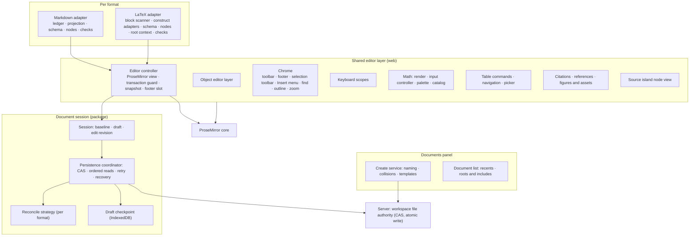

# Scient document editing foundation

> **Status: first proposal for discussion — not accepted.** Drafted 2026-09-26 from
> `origin/main` at `2cfebad566`. Nothing here changes current behavior.
>
> Status labels used below:
>
> - **Direction** — agreed by the product owner; details are still open.
> - **Proposed** — a recommendation that has not been agreed yet.
> - **Open** — needs a decision before the work that depends on it starts.
>
> This record extends, and does not replace,
> [the rich Markdown editor contract](./scient-rich-markdown-editor.md). That
> contract remains the accepted source for source preservation, the document
> session, the verification matrix, and the performance budgets. Once this record
> is accepted, the rules shared by all formats move here and that document keeps
> the Markdown-specific ones.

## Why this exists

Scient has two rich editors for scientific writing, and they are growing apart:

- **Markdown.** The rich Markdown editor on `main` is built directly on ProseMirror,
  with a source ledger, a persistence coordinator, and KaTeX math edited through the
  shared math input controller. It is mature and tested. It also carries design
  debt:
  - object editors are mounted inside the document flow;
  - keyboard dispatch is layered three or four times;
  - `view.ts` and `ScientMarkdownControls.tsx` are about 1,900 lines each;
  - a stale projection is corrected by a queued microtask.
- **LaTeX.** The LaTeX Write view proposed in
  [PR #353](https://github.com/ScientFactory/scient-desktop/pull/353) uses Tiptap
  and MathLive. It brings its own localStorage draft journal, its own toolbar and
  footer, and its own math, table, and figure editing. It has the right idea:
  `.tex` stays authoritative and only changed blocks are patched. But it drifts in
  fidelity and does not reuse what Markdown already solved. It also contributes
  good design ideas, which this record adopts: the footer, the Documents panel, the
  Insert dialog, document checks, and zoom.
- **Three persistence paths.**
  - Markdown's coordinator and registry;
  - the older `fileSaveCoordinator`, used by the LaTeX source view and other text
    files;
  - #353's visual draft journal.

Most of what makes a document editor trustworthy is not specific to the format:

- saving, recovery, and conflicts;
- source-preservation rules;
- object editors that leave the layout alone;
- math input;
- tables;
- find and replace;
- keyboard ownership;
- creating documents;
- the editor chrome.

The formats differ in syntax, in how their constructs map to document nodes, and
in their output: for Markdown the rendered page is the output, for LaTeX the
compiled PDF is.

**Goal:** one editing foundation with per-format adapters and one interaction
language. Improvements then land once, and both editors feel like the same
product.

## Scope

**In scope:**

- The rich Markdown editor.
- The LaTeX Write view.
- The source views these editors pair with.
- The Documents panel.
- The shared architecture, look, and interaction of all of the above.

**Out of scope:**

- The chat composer (T3's Lexical and Tiptap composer editors).
- PDF reader internals.
- The TeX build service.
- Multi-user collaboration.
- MDX.

## Product principles

These generalize the Markdown principles to every file-native document format.

1. **The file is the document.** The `.md` or `.tex` file on disk is canonical,
   portable, and editable by agents. The editor state can always be discarded and
   rebuilt from the source.
2. **No action means no mutation.** Opening, focusing, selecting, switching views,
   zooming, and closing never change bytes or the revision.
3. **Preserve what the user did not change.** This applies between blocks _and
   inside an edited block_. Spelling, delimiters, command names, dashes, line
   breaks, and whitespace outside the edited span stay exactly as written.
4. **Rich when possible, source when necessary.** An unsupported construct becomes
   a source island holding its exact text. It never disables rich editing
   elsewhere.
5. **Never offer an edit that cannot be saved.** A region is editable only if a
   representative edit to it round-trips. Controls for edits that would be
   rejected are not offered.
6. **Every control has one home.** The page holds only content. Commands, object
   properties, status, and transient editors each live in one predictable place.
   None of them moves the document.
7. **Quiet when safe, clear when at risk.** Routine saving is invisible. Status
   draws attention only when work is at risk or needs a decision.
8. **Honest about output.** For LaTeX, the Write view is an approximation derived
   from the source, and the built PDF is authoritative. Nothing implies that an
   unbuilt edit is final output.
9. **Few steps.** Creating, inserting, and navigating take the fewest steps that
   remain safe. Anything that can be defaulted or edited in place later is not
   asked for up front.
10. **Keyboard-complete, direction-aware, local.** Every action is reachable from
    the keyboard. RTL and mixed-direction text work throughout. Editing needs no
    hosted service.

## Experience model

This section defines the look and interaction. Both editors should read as one
product: the same anatomy, the same control homes, the same keys for the same
actions. Formats differ only where the formats themselves differ.

### Surface anatomy — Direction

```text
┌──────────────────────────────────────────────────────────────────────┐
│ Header   file name · Write / Source / PDF · file actions             │
├──────────────────────────────────────────────────────────────────────┤
│ Toolbar  document-level commands · priority overflow into More       │
├──────────────────────────────────────────────────────────────────────┤
│                                                                      │
│   Page   the document itself, rendered and directly editable         │
│          · selection toolbar and Insert menu appear at the caret     │
│          · object editors float, anchored to their object            │
│                                                                      │
├──────────────────────────────────────────────────────────────────────┤
│ Footer   [selected object's properties]        [position · status]   │
└──────────────────────────────────────────────────────────────────────┘
```

Each zone has one job:

| Zone    | Job                                                            | Holds                                                                         | Never holds                                                                    |
| ------- | -------------------------------------------------------------- | ----------------------------------------------------------------------------- | ------------------------------------------------------------------------------ |
| Header  | Which file and which view                                      | File name, view switch, file actions (rename, export)                         | Status, formatting                                                             |
| Toolbar | Document-level commands                                        | Text style, lists, link, Insert, math, undo and redo, More                    | Controls that change with the selection; it does not reflow as the caret moves |
| Page    | Content                                                        | The document, the selection toolbar, the Insert menu, floating object editors | Controls placed in the document flow                                           |
| Footer  | Where you are, what is selected, what state the document is in | Properties of the selected object, position, counts, checks, file state       | Document-level commands                                                        |

**Placement rule:**

- Editing an object's _content_ (formula source, diagram or chart source) happens
  in a floating editor next to the object.
- Changing an object's _properties or structure_ happens in the footer.
  - Table: rows, columns, alignment, style, caption.
  - Equation: type, numbering, label.
  - Image: width, caption, alt text.
  - Code block: language.
- Nothing is inserted into the page to edit an object.

### Footer — Direction

The footer is shared by both formats. It is one line high at a fixed height, even
when nothing is selected, so it never shifts the page. It is present in Write
view. In Source view it keeps the status half and shows line and column.

```text
[Table  + row  + column  align ▾  style ▾  caption]    Table · r3 c2 · 1,284 words · 2 issues · 1 source block · ●
```

**Left: properties of the selected object.**

- A slot owned by the editor controller. Node views register their controls
  there; they do not search the DOM for it.
- Empty when plain text is selected.
- Uses the app's shared UI primitives, not native `<select>` or `<details>`.

**Right: status.** Left to right:

1. **Position.** The caret's context ("Heading 2", "Table · row 3, column 2",
   "Equation"). LaTeX adds the page ("3 / 12").
2. **Count.** Words in the document, or the selection's word count while text is
   selected.
3. **Checks.** "2 issues" when the document has problems (see
   [Document checks](#document-checks--proposed)). Clicking opens the list. Hidden
   when there are no issues.
4. **Source islands.** "1 source block" when content is kept as exact source.
   Clicking moves to the next island. Hidden when there are none.
5. **File state.** One quiet dot that stays hidden while routine saves are
   healthy. It shows publishing that takes unusually long, and it turns into the
   recovery action on a conflict or an exhausted failure. For LaTeX it also shows
   build freshness ("PDF is older than the source"). File state lives here, not
   in the header.

**Accessibility.**

- The footer is not one large live region. Caret movement is never announced.
- Only file-state changes that need attention, and new check results, are
  announced politely.
- Every footer control is reachable from the keyboard, and one shortcut moves
  focus into the footer.

**What this changes in Markdown today:**

- Table tools move from the toolbar into the footer.
- The toolbar stops auto-expanding when the caret enters a table.

### Object editors — Proposed

Floating editors for object _content_:

- inline and display math;
- Mermaid, Vega-Lite, and Plotly source;
- the citation and reference picker.

They are portaled and anchored to their object, with one active at a time per
surface. See [Object editor layer](#object-editor-layer--proposed).

### Views — Proposed

Both formats use the same vocabulary:

- **Write** — the rich page.
- **Source** — the exact text.
- **PDF**, and **Write + PDF** side by side — LaTeX only.

Markdown keeps the inherited eye toggle, labeled Write and Source. **Open:**

- whether Markdown gains Write + Source side by side;
- which view LaTeX opens in by default.

### Canvas — Proposed

|                         | Markdown                                | LaTeX                                                         |
| ----------------------- | --------------------------------------- | ------------------------------------------------------------- |
| Page                    | Continuous sheet at a reading measure   | Paged paper that approximates the document class and geometry |
| Output                  | The rendered page _is_ the output       | The built PDF is the output; the page approximates it         |
| Zoom, fit, width, pinch | Shared control (new for Markdown)       | Shared control (from #353)                                    |
| Outline                 | Shared side panel, collapsed by default | Same                                                          |

### Keyboard — Proposed

- The same command uses the same key in both formats: bold, italic, heading
  levels, lists, link, insert math, Insert menu, find, undo, redo, and focus
  footer.
- Commands that exist in only one format live in that format's scope.
- Escape moves outward in one fixed order everywhere:
  1. nested editor;
  2. object editor;
  3. popover or menu;
  4. selection.

### Visual language — Proposed

- **Shared stylesheet.** Chrome styles (toolbar, footer, menus, popovers, object
  editors, find bar, Documents panel) move to one shared stylesheet on app tokens.
- **Per-format document styles.** Each format keeps only its _document_ styles:
  content typography, plus the page for LaTeX.
- **No hard-coded colors** in chrome.
- **Validation.** Every change to look and feel is checked in the running app with
  screenshots, and short recordings for interaction. Automated checks and the
  owner's visual acceptance are recorded separately.

## Documents panel — Direction

A right-panel surface that is the home for writing in a project, for Markdown and
LaTeX alike. The concept comes from #353. This record keeps the concept and
removes the steps that are not needed.

### Layout

```text
┌ Documents ─────────────────────────────── [Files] ┐
│ New                                               │
│ [Note] [Lab entry] [Paper draft] [Report] [Blank] │  ← templates, both formats
│ [Assignment] [Proposal] [Thesis] …                │
│                                                   │
│ [Find a document…]                                │
│ Recent                                            │
│   ▸ paper/main.tex          LaTeX                 │
│       sections/intro.tex                          │
│   · notes/2026-09-26.md     Markdown              │
│ In this project                                   │
│   …                                               │
└───────────────────────────────────────────────────┘
```

### Creating a document: two steps

1. **Pick a template.** A title field opens inline on that card. The derived file
   path shows underneath as a quiet hint; clicking the hint edits it.
2. **Press Enter.** The file is created (create-only, never overwriting) and opens
   in Write view with the caret in the body.

Nothing else is asked:

- **Author** is filled in from the user's profile.
- **Course, institution, and date** are edited on the page itself, in the title
  block.
- **No confirmation noise:** there is no source preview, no success toast, no
  "Saved" notice, and no explanatory footnote.
- **Failures stay inline.** An existing path or an invalid name shows an inline
  message on the same field.

### Lists

- **One list for both formats**, each entry marked with a format icon, with search
  at the top. Recents come first, then everything else in the project.
- **LaTeX shows root documents only.** Included chapters are nested under their
  root, using the existing root resolution. They are not listed as separate
  documents.
- **Duplicate** is an action on any document row. It replaces #353's separate
  "use a project template" flow.
- **Recents** use the app's storage helpers, not raw `localStorage`.

### Templates

- **Markdown:** a small set, such as Note, Lab notebook entry, Meeting notes, and
  Paper draft (with front matter).
- **LaTeX:** #353's five (Assignment, Report, Proposal, Thesis, Blank).
- Templates are data, one file each.
- User and project templates ("Save as template") come later.

### Where new documents go — Proposed

- **Markdown:** a single file in the folder currently selected in Files, or the
  project root.
- **LaTeX:** its own folder, `<title>/main.tex`. Templates that cite also get a
  `references.bib` beside it, because a LaTeX document grows into a folder of
  figures, bibliography, and build output. **Open:** confirm this layout.

### One create path

- The small **+** in the file browser stays, for quick untitled files, and gains a
  `.tex` option.
- It and the Documents panel call one shared create service, which owns naming,
  collision handling, and template filling. There is no second creation
  implementation.

## Shared writing tools — Proposed

Each of these is implemented once. The format adapter supplies the items, the
syntax, and the rules.

1. **Insert menu.** `/` on an empty line and Cmd/Ctrl+/ open one searchable menu.
   It replaces Markdown's slash menu and #353's Insert dialog. Items come from the
   format's construct adapters, so only constructs that can actually be saved are
   offered.
2. **Outline.** A collapsible side panel listing headings, plus figures, tables,
   and equations where the format labels them. It replaces Markdown's More-menu
   outline and #353's navigation pane.
3. **Document checks.** See [Document checks](#document-checks--proposed). The
   seed of this is #353's Review dialog.
4. **Zoom, fit, width, and pinch.** One canvas control for both formats.
5. **Figure and image picker.** Lists the project's images and supports upload.
   Paths resolve from the document's _build context_: the root file's folder for
   LaTeX, the file's own folder for Markdown.
6. **Citation and cross-reference picker.**
   - Sources: the Sources library, `packages/scient-citations`, linked `.bib`
     files, and the document's labels and headings.
   - Inserts `[@key]` in Markdown, `\cite{key}` or `\ref{label}` in LaTeX.
   - Neither editor uses Sources today.
7. **Document properties.** One place for metadata: title, author, and date in
   LaTeX; front-matter fields in Markdown. It opens from the toolbar's More menu.
   LaTeX adds page layout (paper, base font, margins, paragraph style) and writes
   _only the setting that changed_.
8. **Table picker.**
   - Markdown's progressive size picker, combined with #353's style presets.
   - Presets are per format.
   - Presets that need a package are offered only when that package is available
     or can be added.
9. **Find and replace.** The shared find bar and search plugin. Atoms (math,
   citations, source islands) are searched through their source text. The LaTeX
   Write view has no find today.
10. **Cite selection to chat.** Markdown's `FileCitation` capture extends to LaTeX
    through the session's mapping from document ranges to source ranges.

### Document checks — Proposed

Checks run on the source after a quiet delay and never block editing. Results
appear as the footer count and as a list that jumps to each location.

| Format   | Checks                                                                                                                                                                             |
| -------- | ---------------------------------------------------------------------------------------------------------------------------------------------------------------------------------- |
| LaTeX    | Repeated labels, references to missing labels, citations missing from linked bibliographies, missing images, packages or declarations a construct needs but the root does not load |
| Markdown | Broken wiki links, missing images, undefined footnotes and reference links, links to missing headings                                                                              |

## Architecture

### Layers — Proposed



### Editing framework: ProseMirror directly — Proposed

The Markdown contract chose ProseMirror behind Scient-owned adapters and declined
Tiptap. Scient needs direct control of transactions and serialization to keep
source authoritative. #353 uses Tiptap over the same ProseMirror packages, and the
lockfile already resolves a single version of each.

**Proposal:** shared node views, plugins, and commands target ProseMirror
directly, and the LaTeX Write view is built on the shared controller rather than
Tiptap.

**Consequences:**

- #353's React node views are ported, not reused.
- The LaTeX editor gains Markdown's proven pieces for free: source islands, nested
  CodeMirror, find.
- Only one node-view style has to be maintained.

**Alternative:** keep Tiptap for LaTeX and share only plugins and commands. Every
shared node view (math, source island, table, figure) would then need two
wrappers.

### Format adapter contract — Proposed

A format plugs in through one adapter. Roughly:

```ts
interface DocumentFormatAdapter<Context> {
  /** Parse source into top-level blocks with exact ranges plus a ProseMirror doc. */
  project(source: string, context: Context): Projection;
  /** Source for the next doc, or a typed refusal. Must reparse to the same doc. */
  apply(previous: Projection, next: PMNode): SourceEdit | Refusal;
  /** Incremental adoption of an external source change, reusing unchanged nodes. */
  adoptExternal(previous: Projection, source: string): Projection | null;
  /** Merge of baseline/local/disk for the session's reconciliation step. */
  reconcile(base: string, local: string, disk: string): string | Conflict;
  /** Document context that other files contribute (e.g. LaTeX root preamble). */
  context: ContextResolver<Context>;
  /** Source checks shown in the footer. */
  check(projection: Projection, context: Context): readonly DocumentIssue[];
}
```

The rules every adapter follows:

- **Blocks carry exact source ranges.** Unchanged blocks are copied byte for byte.
- **Minimal patch first.**
  - An edit inside a block becomes the smallest text patch, verified by reparsing.
    This is what Markdown's `minimallyPatchedTextBlock` does.
  - Re-serializing a whole block is only the fallback for real structural changes.
  - #353 lacks this rule, which is why it rewrites or rejects `--`, `\textit`, line
    breaks, and `~`.
- **Source islands are one shared node** with a per-format label. Markdown's
  `raw_block` and #353's `latexRawBlock` become one exact-text CodeMirror island.
- **Construct adapters.** Inside a format, each supported construct (heading,
  list, figure, table, theorem, citation, …) registers:
  - how it is recognized, and a bounded parse;
  - its node;
  - its serialization;
  - what it needs from the document (packages, declarations);
  - when direct editing is safe;
  - its tests.

  This follows the adapter-registry recommendation in #353's own notes. It
  replaces an ever-growing parser switch and feeds the Insert menu and document
  checks.

- **Editability is proven, not assumed.** A property test per adapter:
  1. generates documents;
  2. projects them;
  3. applies a small edit to every region marked editable;
  4. requires the edit to be accepted with unchanged bytes identical.

### Document session and persistence — Proposed, two phases

**Phase A: one session layer for every text format.**

- Generalize `@scientfactory/scient-markdown`'s session, persistence coordinator,
  and checkpoint into a format-neutral package, working name
  `@scientfactory/scient-document`.
  - The only Markdown dependency today is `reconcileMarkdown`, which becomes the
    adapter's `reconcile`.
  - The ledger and projection stay in `scient-markdown`.
- The web registry, leases, ordered transport, departure guards, and recovery UI
  move to the shared editor layer.
- **Migration order:**
  1. Markdown moves first, with no behavior change; its tests are the proof.
  2. The LaTeX source view and Write view then use the same session, instead of
     `fileSaveCoordinator` plus a visual draft journal.
  3. Whether other editable text files follow is **Open**.
- Markdown's stale-projection path is fixed in the move. A rejected change is
  never pushed into the view and then corrected by a microtask.

**Phase B: server-ordered edit operations** (from the 2026-09-21 reliability
proposal).

- Editors submit ordered text operations.
- A server coordinator orders them across windows.
- Recovery and publication are acknowledged separately.
- Watcher events caused by Scient's own writes are recognized as such.

Phase B changes transport and durability, not the editor contract, provided Phase
A already submits exact text changes (with origin and base revision) rather than
whole-document snapshots. **Proposal:** shape the Phase A session interface around
`TextChange` operations now, even though it is still backed by snapshot CAS
writes.

**Multi-file LaTeX edits — Proposed.**

- A LaTeX document is a root plus included files, and each file has its own
  session.
- Some edits must touch another file. Inserting a figure in a chapter, for
  example, requires `\usepackage{graphicx}` in the root.
- **First step:** decline with guidance when the root lacks the requirement. A
  document check also reports it.
- **Later:** a small _document group_ applies linked edits across files, each
  with its own CAS write, and asks the user on partial failure.

### Object editor layer — Proposed

This takes the ownership rules from the 2026-09-21 proposal and applies them to
both formats.

- **Covers:**
  - inline and display math;
  - Mermaid, Vega-Lite, and Plotly source;
  - the citation and reference picker.

  Object _properties_ are edited in the footer, not here.

- **Ownership.**
  - The node view owns source changes, validation, and its persistent input
    instance.
  - The layer owns which editor is open, where it is placed, collision handling,
    dismissal, and returning focus.
- **Anchoring.** The rendered object stays in place as the anchor. Opening,
  validating, resizing, or closing an editor never changes document layout.
- **No remounting.** Attribute transactions, validation results, save
  acknowledgements, and presentation refreshes never remount the active input.
- **Commit model.** Changes apply as the user types. Escape closes the editor.
  Each object editing session is one undo step.
- **Invalid input is normal.**
  - Incomplete TeX or JSON is saved exactly as typed.
  - The last valid render is only a presentation cache.
  - A small, stable error status appears only after validation, never on every
    keystroke.

### Math — Open (spike first)

These are shared whichever input wins:

- **Source model.** Math is TeX in both formats. Delimiter and environment spelling
  is preserved as written.
- **Rendering.** KaTeX through `scient/math`, which chat and Markdown already
  share.
- **Catalog.** Merge `scient/math/input/catalog` with #353's LyX-derived symbol
  catalog (827 entries, with Unicode and package metadata) into one catalog that
  carries package requirements. It serves the palette, completion, and LaTeX
  preamble additions.
- **Controller.** `MathInputController`, which already abstracts the host editor
  through `MathInputAdapter` and knows the `latex` format.

The **input** choice is open:

| Option                                                                                   | For                                                                              | Against                                                                                                                           |
| ---------------------------------------------------------------------------------------- | -------------------------------------------------------------------------------- | --------------------------------------------------------------------------------------------------------------------------------- |
| A. Source field + controller + palette and completion (Markdown today)                   | Exact source; native IME, undo, and selection; no new dependency; already shared | Less WYSIWYG for complex expressions                                                                                              |
| B. MathLive structured field (#353)                                                      | Structured editing of fractions and matrices                                     | Large dependency; the patched build bundle is a maintenance burden; it normalizes source; it adds a second renderer next to KaTeX |
| C. A by default, with MathLive as an optional structured mode inside the floating editor | Both benefits                                                                    | Two input paths to qualify                                                                                                        |

**Proposal:** a short spike of A versus C in _both_ editors, using formulas taken
from real papers. Leaning: A as the foundation, C only if the spike shows clear
value.

### Keyboard — Proposed

- `KeyboardScope` becomes a registered set rather than a closed union: `markdown`,
  `latex`, `math`, `pdf`, and a shared `document` scope for common commands.
- Each surface has **one** dispatch path. Markdown's layered dispatch (direct
  props, plugin keymap, workspace sequence, React fallback) collapses into it.
- Splitting `view.ts` and `ScientMarkdownControls.tsx` follows from these
  extractions. It is not a separate refactor.

### Tables — Proposed

- Shared commands, navigation, and picker over one table node spec, parameterized
  by the cell content model.
- Serialization is per format:
  - GFM for Markdown, with spans rejected;
  - tabular, tabularx, and longtable for LaTeX, preserving each cell's source
    through structural operations.
- A structural action is offered only when every affected cell can be rewritten
  without loss.

### LaTeX output relationship — Open

- The Write view approximates layout from the document class, options, and
  explicit geometry. The PDF is authoritative.
- Whether builds run automatically on save (current `main`) or only on request
  (#353) is a product decision outside this record.
- Either way, build freshness appears in the footer's file state.

## Proposed module layout

```text
packages/scient-document/            (new; generalized from scient-markdown)
  session.ts  persistenceCoordinator.ts  textChange.ts  checkpoint contract
packages/scient-markdown/            (kept; Markdown adapter logic)
  sourceLedger.ts  reconciliation.ts
packages/scient-latex-source/        (new, Open; pure LaTeX projection testable in Node)

apps/web/src/scient/documentEditor/  (new; shared editor layer)
  controller/  objectEditors/  chrome/ (toolbar, footer, menus)  find/  tables/
  islands/  checks/  persistence/  keyboard bindings
apps/web/src/scient/documents/       (Documents panel, create service, templates)
apps/web/src/scient/markdownEditor/  (Markdown adapter, nodes, Markdown-only UI)
apps/web/src/scient/latex/write/     (LaTeX Write adapter, nodes, page canvas)
apps/web/src/scient/math/            (render, input controller, merged catalog)
```

Names are working titles. Upstream seams remain as the Markdown contract
describes: inherited files mount Scient modules and contain no editing policy.

## Shared quality gates — Proposed

- **Fidelity.** For each adapter:
  - golden tests;
  - property tests for "unchanged bytes identical" and "editable implies
    accepted";
  - a regression corpus that includes every reproduction from the #353 review:
    `~`, dashes, `\textit`, multi-line paragraphs, formatted table cells, labels
    with `_`, and fragments that need root declarations.
- **Performance.**
  - Markdown's typing and open budgets apply to both formats.
  - LaTeX must not reparse the whole file on every keystroke beyond budget. #353
    measured 55 ms at 363 KB, before pagination.
- **Persistence.** Markdown's verification matrix (no mutation on view switch,
  external-edit safety, recovery) applies to every format on the shared session.
- **Experience.** Every step includes screenshots or recordings in the running
  app. Automated checks and the owner's visual acceptance are recorded
  separately.

## Delivery sequence — Proposed

Each step fixes something real in Markdown _and_ produces a shared piece. Markdown
is the first consumer; the LaTeX Write view is built on the finished foundation.

| Step | Markdown outcome                                                                       | Shared piece                                                                   |
| ---- | -------------------------------------------------------------------------------------- | ------------------------------------------------------------------------------ |
| 0    | —                                                                                      | This record, agreed                                                            |
| 1    | Math and diagram editors stop moving the page; no premature "last valid" warning       | Object editor layer                                                            |
| 2    | Table tools leave the toolbar; word count, source islands, and file state in one place | Footer and toolbar zones                                                       |
| 3    | No stale-projection microtask; saving logic in one place                               | `scient-document` session and persistence (Phase A)                            |
| 4    | One keyboard dispatch path; `view.ts` and the controls split                           | Chrome, Insert menu, find, outline, keyboard scopes                            |
| 5    | Markdown templates and a home for writing                                              | Documents panel and create service (Markdown first; LaTeX templates from #353) |
| 6    | Source islands and tables on the shared contract; document checks                      | Adapter contract, island node view, table commands, checks                     |
| 7    | Math input decided by the spike                                                        | Merged math catalog and input                                                  |
| 8    | —                                                                                      | LaTeX Write view on the foundation, porting what holds up from #353            |
| 9    | Multi-window and external-edit robustness                                              | Phase B server-ordered operations                                              |

Small, self-contained fixes land whenever convenient and are not held for a step.

## Working on shared pieces

This section is for anyone, including #353's author, who wants to build
something both editors will use.

**Read first:**

- This record, for direction and open decisions.
- [The rich Markdown editor contract](./scient-rich-markdown-editor.md). It is the
  accepted rulebook for:
  - source preservation ("Source preservation", "Incremental work");
  - the document session and persistence ("Document session" and the
    coordinator paragraphs under "Selected foundation");
  - the verification matrix;
  - the performance budgets.
- [Keyboard ownership](./scient-keyboard.md), [math rendering](./scient-math.md),
  and the [LaTeX build](./scient-latex.md).

**Code to build on, not duplicate:**

| Concern                                 | Start here                                                                                                                             |
| --------------------------------------- | -------------------------------------------------------------------------------------------------------------------------------------- |
| Session, saving, conflicts, recovery    | `packages/scient-markdown/src/{session,persistenceCoordinator,reconciliation}.ts`; `apps/web/src/scient/markdownEditor/persistence/`   |
| Minimal source patching                 | `apps/web/src/scient/markdownEditor/prosemirror/projection.ts` (`minimallyPatchedTextBlock`) and `externalProjection.ts`               |
| Source islands                          | `apps/web/src/scient/markdownEditor/nodes/{rawBlockNodeView,codeMirrorCodeEditor}.ts`                                                  |
| Math input                              | `apps/web/src/scient/math/input/` (`MathInputController`, `MathInputAdapter`), `apps/web/src/scient/math/` (KaTeX)                     |
| Toolbar and find                        | `apps/web/src/scient/markdownEditor/ui/dockChrome.tsx`, `ui/ScientFindBar.tsx`, `prosemirror/search.ts`                                |
| Tables                                  | `apps/web/src/scient/markdownEditor/prosemirror/{tables,tableNavigation}.ts`, `apps/web/src/scient/markdownEditor/tableContextMenu.ts` |
| Keyboard                                | `apps/web/src/scient/keyboard/`                                                                                                        |
| File surfaces and departure guards      | `apps/web/src/scient/fileSurfaces/`                                                                                                    |
| Rendered cards (diagrams, charts, code) | `apps/web/src/scient/presentation/`                                                                                                    |

**Ground rules while this record is a proposal:**

- Target ProseMirror directly for anything meant to be shared.
- Do not add another persistence or draft path. Extend the session instead.
- A shared piece lands with Markdown as its first consumer, with Markdown's tests
  as proof.
- Before starting a delivery step, say so on the design-record PR so the work is
  not duplicated.

## Relationship to PR #353

**Carried forward** (ported onto the foundation, not merged as-is):

- `.tex` authority with patching limited to block ranges.
- The block scanner's knowledge of LaTeX structure.
- The layout profile derived from `classes.dtx`.
- The pagination approach.
- The footer concept.
- The Documents panel concept and the LaTeX templates.
- The Insert dialog, outline pane, Review checks, and zoom controls, as shared
  tools.
- The symbol catalog and package metadata.
- The table presets.
- The adapter-registry and source-popover recommendations.
- The build-service hardening and standalone fixes, as their own PRs.

**Not carried forward:**

- Tiptap React node views (if the ProseMirror decision holds).
- The localStorage visual draft journal.
- The unused PDF-overlay chain.
- Re-serializing whole blocks of prose.
- The MathLive bundle patch.
- Scient metadata written as comments into the preamble.

**Open:** how to work with the contributor. They rebuild on the foundation, we
port, or a mix.

## Decisions to discuss

1. **Editing framework.** ProseMirror directly for both formats, or Tiptap for
   LaTeX.
2. **Math input.** Option A, B, or C, and the design of the spike.
3. **Views.** The shared Write/Source/PDF vocabulary; LaTeX's default view;
   whether Markdown gets a side-by-side view.
4. **New LaTeX documents.** Use the `<title>/main.tex` folder layout or not.
5. **Session scope.** Package name and boundary; whether other editable text files
   move to the session; a `TextChange`-shaped interface in Phase A.
6. **Build policy.** Automatic or on request (outside this record).
7. **PR #353.** How to work with the contributor.
8. **Markdown canvas.** Shared zoom and width, and the reading measure.
