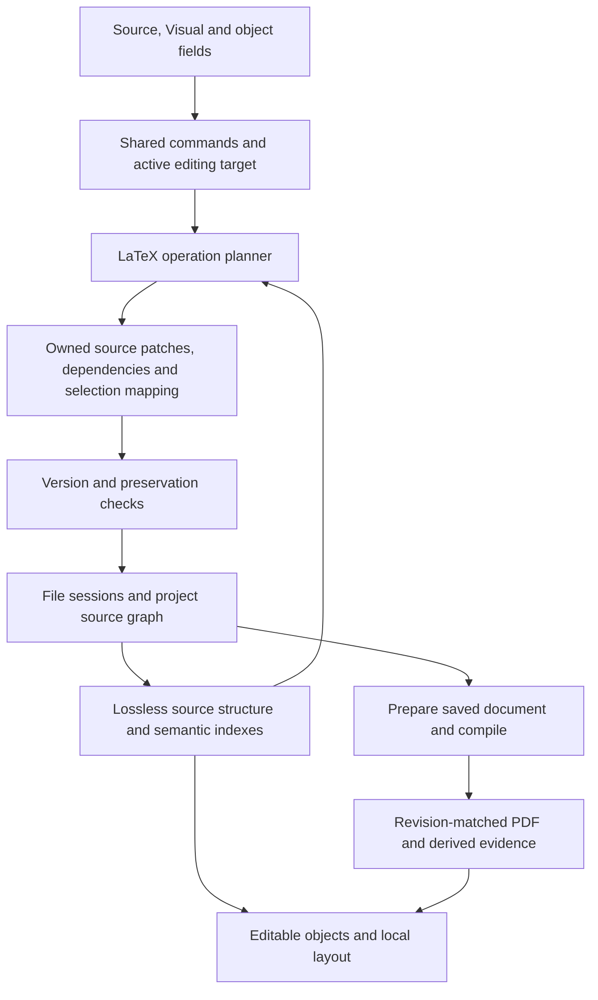

# Visual editor: architecture and implementation plan

**Status:** Proposed direction, updated 2026-10-03 after reviewing the merged editor and local Visual improvements. This document plans future work; it does not claim the workflows below are implemented or qualified. Current implementation details remain in [Source-derived writing canvas](../../docs/internals/scient-latex-visual.md).

## 1. Recommendation

Build Visual as a structured authoring surface over the user's existing LaTeX project. Keep the existing Tiptap, MathLive, shared writing controls and file sessions. Extend the source adapters so every supported object has consistent ways to **create, edit, configure, reference, copy and undo** it.

The central investment should be a shared description of each object's capabilities and source ownership. Adding another special renderer without its editing, insertion and preservation rules should no longer count as finishing a feature.

The intended result is comfortable visual authoring for a thesis, paper, report, homework assignment, exam, solution sheet or compact reference sheet. The normal supported workflow should not require LaTeX code. Imported constructs outside that coverage must retain their exact source and remain clearly distinguishable.

Keep the current appearance and the merged menu arrangement. This plan adds depth inside existing menus and the contextual footer. It does not propose another permanent toolbar or a new editor framework.

### Scope

- Cover prose, rich mathematics, references, bibliographies, document structure, tables, figures with ordinary images, lists, statements, algorithms, code, color, boxes and composed page layouts.
- Include project roots, included chapters, shared definitions, fonts, engines and package requirements as part of authoring.
- Defer new TikZ/PGFPlots authoring, Beamer, drawing tools and arbitrary TeX execution in Visual. Existing content in those forms must remain intact.
- Treat exact TeX pagination and arbitrary package behavior as compiler-dependent. “Almost everything” means completing named workflows with explicit limits, rather than claiming every TeX program can be edited visually.

## 2. What we already have

This is based on source inspection of the current working tree, including the recent merge. Display support, editing support and UI reachability still need separate qualification.

| Area                | Existing foundation                                                                                                                                                                    | Gap to address                                                                                                                        |
| ------------------- | -------------------------------------------------------------------------------------------------------------------------------------------------------------------------------------- | ------------------------------------------------------------------------------------------------------------------------------------- |
| Shared controls     | `writing/` owns Text, Insert, reader controls, footer and find/replace.                                                                                                                | New features should register actions here through LaTeX capabilities, without duplicating menus.                                      |
| Saving              | `packages/scient-document` supplies sessions, exact source patches and persistence coordination. The registry gives views of a file one saver.                                         | Migrate remaining LaTeX planning to the shared patch contract; coordinate changes involving several files with the persistence owner. |
| Pending input       | Field ownership, save preparation and comparison-first LaTeX recovery already exist.                                                                                                   | Preserve these paths during adapter changes. Recovery-store consolidation remains maintainer-owned work.                              |
| Source projection   | `latexVisualDocument.ts` has bounded parsers, source ranges, narrow patching and structural round-trip checks.                                                                         | Recognition, structural operations and capability checks remain dispersed and partly container-specific.                              |
| Projects            | `latexProjectVisual.ts` assembles supported includes and maps edits to physical files.                                                                                                 | Make occurrence identity, include-boundary insertion and context invalidation explicit for every operation.                           |
| Nested editing      | Structured statement/layout bodies and rich inline table cells exist. `latexEditingTarget.ts` routes commands to the active field.                                                     | Complete common caret, selection, clipboard and undo rules across all containers.                                                     |
| Macros and packages | `latexDocumentMacros.ts`, `latexEnvironmentDeclarations.ts` and `latexPackages.ts` read supported declarations and infer some requirements. Settings displays a package/macro summary. | A usable manager, scope-aware dependency tracking and reversible editing of more macro arguments are still needed.                    |
| References          | Labels, derived numbers, citation pickers and the References panel exist. Manual `\bibitem` and linked `.bib` editing are supported in bounded forms.                                  | Project-wide renaming, usage navigation, richer citation commands and additional bibliography presentations need explicit adapters.   |
| Complex objects     | Table variants, longtables, color boxes, algorithms, theorem declarations, figures and column/panel layouts have adapters.                                                             | Rendering an imported object does not establish full insertion or structural editing support. Some operations remain refused.         |
| Layout              | Source-derived CSS, local pagination and compiled bibliography evidence exist.                                                                                                         | Long column regions, float placement and some generated structures still differ from TeX.                                             |

Useful code owners:

- [Visual projection and patches](../../apps/web/src/scient/latex/latexVisualDocument.ts)
- [Project source ownership](../../apps/web/src/scient/latex/latexProjectVisual.ts)
- [Shared patch contract](../../packages/scient-document/src/sourcePatch.ts)
- [Document save/build preparation](../../apps/web/src/scient/latex/prepareLatexDocument.ts)
- [Active editing target](../../apps/web/src/scient/latex/latexEditingTarget.ts)
- [Merged menu decisions](../../docs/design/editing-commands-placement.md)

The earlier efficiency changes are retained at the end of this document as a historical note, not evidence for the future architecture.

## 3. Minimal interface, complete workflows

Use the current bar:

```text
Undo  Redo | Text | Insert | Math | Lists | Document
```

Follow the newer merged [menu decisions](../../docs/design/editing-commands-placement.md) when older proposal text describes a different placement. Reading controls remain in their current host header; the contextual footer remains a stable strip for object options.

### Where actions belong

All additions below are proposals inside the existing menu hierarchy.

| Existing home                                           | Proposed coverage                                                                                                                                                                                                                                                     |
| ------------------------------------------------------- | --------------------------------------------------------------------------------------------------------------------------------------------------------------------------------------------------------------------------------------------------------------------- |
| **Text → Paragraph style / Formatting / Alignment**     | Existing text actions; later add scoped text color, highlight and size. Distinguish changing this selection from changing a document style. Keep plain-text subscript/superscript deferred as previously decided; math scripts remain in Math.                        |
| **Math**                                                | Inline/display math, alignment, matrices, cases, searchable symbols and structures. Add document-defined commands to the same picker. The math footer uses the same action definitions.                                                                               |
| **Lists**                                               | List type, nesting and contextual numbering/label options. Description terms are edited on the page.                                                                                                                                                                  |
| **Insert → Table / Figure / Code block / Literal text** | Existing entry points; advanced choices open from their current pickers or object footer.                                                                                                                                                                             |
| **Insert → References**                                 | Citation, Cross-reference, Link and Footnote. Selection inserts at the preserved caret; managing records stays under Document.                                                                                                                                        |
| **Insert → Theorems & proofs**                          | Existing statements and question/subquestion entries; list supported custom environments defined by this document.                                                                                                                                                    |
| **Insert → Document blocks**                            | Abstract, contents, figure/table lists and bibliography. Add Algorithm, Box, Columns, Side-by-side panels and Answer space here, grouped in small secondary sections only when needed.                                                                                |
| **Document → References**                               | Search, add, edit, remove and inspect bibliography entries. Include a labeled-target view for usage and rename operations, rather than another permanent panel button.                                                                                                |
| **Document → Document settings**                        | Keep the existing compact, tab-free settings card. Extend the existing **Packages and macros** summary with **Manage…**, opening a nonmodal panel for packages, commands and environments. Advanced style/header/numbering settings use disclosure or a linked panel. |
| **Document / existing outline**                         | Title/authors, front matter, appendices, document-wide numbering, chapter navigation, review, find/replace and export. Keep project files in the existing file browser.                                                                                               |
| **Contextual footer**                                   | Properties and structural actions for the current object: Table, Equation, Algorithm, Box, Figure, Columns, Citation, etc. One compact object menu when space is limited.                                                                                             |

Use one auxiliary panel host for larger workflows, reusing the existing References pattern. Opening another mode must retain pending drafts and their owning document; it must not silently retarget or discard them. Small forms use anchored popovers. Editing controls should not put a modal backdrop over the document.

Common actions should take one choice. Advanced options can be progressively disclosed. Search, keyboard commands and menus must invoke the same operation, with the same preconditions and undo behavior.

### Interaction contract

- Text, captions, cell contents and supported arguments are edited where they appear.
- A plain click places the caret, activates the relevant context, or follows an explicit reference. It never implicitly selects a whole Contents block, theorem or equation.
- Reference numbers and contents entries navigate to their target; their footer offers editing actions. Footnote markers navigate to notes and notes offer a return action.
- Explicit whole-object selection remains available through the footer or keyboard.
- Dragging or extending a selection out of a nested math slot includes its containing structure first. Re-entering a table or math cell restores a normal caret.
- Clearing selected cells preserves their structure. Deleting a whole object is a separate operation.
- Tab, Shift+Tab, arrows, Enter and Backspace have defined container-specific behavior. For example, Enter inside pseudocode adds a step; Enter in a paragraph-capable table cell adds a paragraph.
- Opening a menu or panel preserves a source-aware insertion bookmark. If its destination changes meanwhile, rebase it through known edits or ask for a new location; never guess.
- A failed conversion keeps the exact pending input, offers a reason and a way to continue. Escape dismisses a control without silently accepting or discarding a draft.
- Selection guides appear only during editing and never enter source, clipboard exports or PDF output.
- Preserve IME composition, graphemes, keyboard-only access, accessible names, screen-reader navigation and stable focus across resize/view changes.

## 4. Architecture and ownership

### 4.1 Extend the current layers



The arrows from compiled evidence affect presentation and diagnostics. PDF coordinates do not authorize source edits.

| Layer            | Responsibility                                                                                                 | Boundary                                                                                               |
| ---------------- | -------------------------------------------------------------------------------------------------------------- | ------------------------------------------------------------------------------------------------------ |
| File sessions    | Working source, accepted edits, disk revisions, outside changes, saves and conflicts.                          | Extend `scient-document` and the existing registry; introduce no second saver or recovery journal.     |
| Project context  | Root selection, include occurrences, dependency files, declarations, build settings and ownership.             | Server remains filesystem and execution authority, including remote workspaces.                        |
| Lossless syntax  | Tokens, groups, command arguments, environments, comments, gaps, literal content and exact ranges.             | Start by consolidating existing scanners and source ledgers; no wholesale parser replacement.          |
| Semantic indexes | Effective definitions, package capabilities, counters, labels, citations, colors, styles and their dependents. | Derived, revision-scoped data; uncertainty is represented explicitly.                                  |
| Object adapters  | Recognize supported forms, expose fields, plan edits and structural operations, supply views and requirements. | Components request semantic actions instead of constructing TeX strings independently.                 |
| Presentation     | Tiptap nodes, MathLive, shared controls, CSS layout and compiled evidence.                                     | Editor trees and layout fragments are disposable projections, never an independent canonical document. |

Keep LaTeX semantics in the LaTeX adapter. Shared writing components own appearance and generic interaction. Changes to shared sessions, recovery, keyboard or math interfaces should be coordinated with their maintainers and preserve Markdown behavior.

### 4.2 Source identity and provenance

Every object and editable field needs:

- Physical file identity: environment, project, normalized path and owning session.
- Session generation and edit version. A disk revision alone does not identify an unsaved draft.
- Include occurrence identity. The same file may appear twice or under different root contexts.
- Object/field identity and owned UTF-16 source ranges, with wrappers, options, comments and separators tracked separately.
- Definition/context dependencies and their generations.
- Origin: literal source, macro argument, shared definition, generated expansion or compiled-only presentation.

Stable identity must survive ordinary edits and movement. Source offsets and rendered text are insufficient identifiers; repeated text and shifted ranges are common. Map identities through accepted patches, and mark ambiguous mappings unresolved.

Editing a repeated include changes its physical file and therefore all uses of that file. Make that consequence visible. Inserting at an include boundary, an empty chapter or a file with no final newline must name the destination file explicitly in the plan.

### 4.3 One capability description per operation

Avoid a single `editable: true` flag. For each object variant, declare separate support for:

1. Display and readable fallback.
2. Content fields that can be edited.
3. Creating a new instance.
4. Structural operations: split, join, reorder, merge cells, change placement, etc.
5. Copy/paste and deletion.
6. Required packages, declarations and valid container contexts.
7. Source ranges it may change and metadata it must preserve.
8. Dependency invalidation and build consequences.
9. Refusal reasons, evidence fixtures and known limits.

For example, a merged table cell may support text editing before it supports column deletion. A theorem may support editing its body while its imported counter definition remains source-owned. Menus should reflect those distinctions without hiding the existence of the feature.

Use a small typed registry around the existing adapters. It should supply command availability, insertion plans and footer properties; avoid a general plugin platform or large inheritance hierarchy before a second concrete use needs it.

### 4.4 Source patch and history rules

An operation plans against one coherent snapshot and produces the smallest set of owned changes. Reuse `DocumentSourceEdit` and `lease.applyEdit` for each file.

Acceptance requires all three checks:

- Reprojection represents the intended edit.
- Source outside the allowed ranges is identical.
- Required information inside those ranges survives: comments, labels, options, widths, delimiters, formatting, Unicode and line endings.

A stale plan is replanned from the latest snapshot or refused with its input retained. Do not “repair” it by searching for similar text.

Ordinary typing may coalesce in history. One structural action is one logical undo step, including its declaration and dependency changes. Nested fields contribute to the document's history rather than maintaining a competing undo stack.

**Several files need a coordinated operation.** Adding a macro to the preamble and using it in a chapter, or renaming a citation key, cannot be made safe by two unrelated saves. Agree a grouped-edit contract with the session owner:

- Validate every participating version and writable destination before acceptance.
- Carry a shared operation ID and before/after patches for logical undo.
- Track acceptance and save acknowledgement per file.
- Preserve all drafts on a partial save failure; show which files remain unsaved.
- Hold build/export until all required inputs settle.
- Recheck versions before undo; never overwrite an outside change to simulate rollback.

Do not claim atomic filesystem saves across files. Until coordinated acceptance and undo are available, refuse an operation that requires them and explain the unavailable destination.

Track declarations created by a particular action. Undo may remove one only if its text is unchanged and no subsequent accepted use depends on it. Existing packages and user declarations are never removed as incidental cleanup. The current package helper deliberately retains packages on undo; improving this requires dependency-aware history, not simply reversing a string insertion.

### 4.5 Partial support inside complex objects

A recognized environment should contain editable children and protected source children wherever their boundaries and scope are known. An unfamiliar inline command should not lock unrelated paragraphs in the same theorem.

Never replace unknown content with stripped “readable” text that changes its meaning. If a command changes parsing or scope, retain a larger exact-source region. Preview-only and generated content must not appear editable until an adapter can map an edit back to its owner.

### 4.6 Copy, duplicate and move across contexts

Clipboard content should offer plain text and LaTeX, with a versioned internal fragment for supported rich objects. Internal metadata is advisory: the destination validates it against its own document context.

- Pasting or duplicating an object must not silently duplicate its labels. Allocate new keys where needed and remap references that belong to the copied fragment; references to external targets retain their meaning or become explicitly unresolved.
- A move preserves object identity when possible; a copy creates new identity. Moving between included files checks both owners and the destination scope.
- A macro or named color from another document may be missing or defined differently. Offer reuse, a renamed compatible definition, or explicit materialization rather than changing an existing definition.
- Asset paths are resolved relative to the destination project. Importing an image is an explicit file operation, not blindly retaining a path from another machine.
- Table paste validates the selected rectangle, spans and destination cell capabilities before changing content.

## 5. Document context: macros, environments and packages

### 5.1 Manage macros through their meaning and scope

Extend the current package/macro summary into a manager with search, definition location, argument shape, uses, scope and support status.

Offer visual creation for a bounded set:

- Named math operators such as rank.
- Symbols such as `\R`.
- Delimiter functions such as norm and inner product.
- Reusable formatted text with named argument slots.
- Theorem-like declarations and simple reusable block templates.

The form shows named slots and a preview built from the same adapter. Advanced declarations stay inspectable in Source; a package's internal macros are not copied into the document merely to make them visible.

Keep these actions explicit:

| Action                        | Effect                                                                               |
| ----------------------------- | ------------------------------------------------------------------------------------ |
| **Edit this use**             | Changes invocation arguments and preserves the command name.                         |
| **Edit definition**           | Updates the owning declaration and all dependent presentations. Shows affected uses. |
| **Rename command**            | Plans a scoped declaration-and-use change across known writable files.               |
| **Make this use independent** | Explicitly materializes that occurrence into supported ordinary source.              |
| **Delete definition**         | Checks known uses and unknown dependency regions before offering removal.            |

A macro expansion is not generally reversible. For `\norm{x}`, the editable argument can be mapped back to `x`. If an argument is repeated, hidden, reordered or mixed with generated material, edit the original argument through a field and update all its displayed occurrences; do not infer an argument from arbitrary edited output.

Handle optional/default arguments, starred forms, text versus math mode, local groups, shadowing, later redefinitions and definitions in included preambles. Detect recursive/cyclic definitions and enforce bounded expansion. Use the effective declaration at each occurrence rather than the final declaration found in the file.

General `\def` programs, catcode changes and unsupported conditionals remain outside bounded interpretation. Unknown dynamic code must also prevent false claims such as “this macro is unused.”

Existing loop materialization should become an explicit, previewed operation with one undo. Merely typing in a generated preview should not silently expand a large loop into pages of source.

### 5.2 Packages are dependencies with provenance

Maintain one inventory that distinguishes:

- Explicit root or included-preamble declarations and their options/order.
- Capabilities supplied transitively by known packages or a recognized class.
- Installed toolchain availability.
- Visual adapter coverage.
- Engine/font requirements and unresolved constraints.

These are different facts. A package may compile successfully while some of its commands remain source-only in Visual.

Insertion requests a semantic capability, such as “table row color,” rather than blindly adding `\usepackage`. The resolver should:

1. Reuse the document's existing compatible provider and dialect.
2. Add the smallest supported missing declaration in the correct preamble.
3. Preserve existing options, load order, comments and class conventions.
4. Detect known incompatible choices and uncertain configuration.
5. Include dependency edits in the insertion plan; never let an unrelated text edit change the preamble.

The manager shows why a package is needed and where it came from. “Remove unused” should mean only a proven case within known coverage. Conditional loads, custom classes and unknown macros prevent a confident unused result.

Account for supported `\PassOptionsToPackage` declarations, class options and local `.sty` files when computing effective configuration. Preserve unknown options and ordering. Treat a change between bibliography backends, algorithm dialects or font systems as an explicit conversion rather than another missing-package insertion.

Opening a document does not rewrite its packages. Installing a missing TeX package uses the existing toolchain path and is distinct from adding its declaration. Changing to LuaLaTeX/XeLaTeX or introducing a font has document-wide consequences and must be explicit.

## 6. References, labels and bibliographies

Keep one document reference service with distinct namespaces for labels, bibliography keys and named hyperlink targets. Reuse the current index while extending its project coverage.

### Labeled objects

- Sections, chapters, appendices, equations/rows, figures/subfigures, tables, algorithms and declared statements expose label and numbering properties in their footer.
- Pickers search by human title, kind, key and location. They can offer to create a collision-free label on an unlabeled target.
- Renaming a label previews its known uses and updates only recognized reference arguments, including optional-label forms such as `\hyperref[label]{text}`.
- Do not rename text in comments, literals or similarly named macros.
- Preserve manual tags, suppressed numbering, shared counters, chapter resets and appendix letters.
- Support `\ref` and `\eqref` first; add `\pageref`, `\autoref` and `\cref` through their own package-aware adapters.
- Detect missing and duplicate labels. Deleting a target surfaces affected references; it does not silently delete citations or prose.
- Distinguish a locally derived number from a compiled page number. Page references require current build evidence; do not substitute Visual's page count as if it were TeX's.

Contents and figure/table lists are generated views of the same targets. Clicking navigates; editing their wording edits a supported heading or short-caption field, not generated output.

### Bibliography records and citation occurrences

Preserve the current approach: manual `thebibliography`/`\bibitem`, BibTeX or a supported BibLaTeX configuration. Never silently convert between them.

**Document → References** manages records; **Insert → References → Citation** manages citation occurrences.

- Forms edit common fields while retaining unknown fields, bracing, string concatenations, comments and original entry type.
- Support keys, optional manual labels, author names, title, date/year, publication, identifiers and URLs. Keep complex name lists and TeX-protected capitalization lossless.
- Show resource ownership, duplicate keys, malformed entries and usage locations.
- Add/remove records in their actual owning file. Removing a cited record requires an explicit choice; existing citations retain their keys and become unresolved.
- Key rename is a grouped operation across bibliography resources and recognized citation uses. Unknown citation macros or inaccessible chapters make coverage incomplete.
- A citation's footer edits selected entries, order, prefix/suffix or note, and command form where the document's dialect supports it.
- Support numeric and author–year presentation through explicit style adapters and matching build evidence. BibLaTeX `.bbl` is a separate format; it must not be sent through the existing bounded BibTeX parser.
- Handle `\nocite`, multiple resources and later multiple bibliography scopes deliberately; do not treat every loaded record as a printed entry.
- Keep metadata fetching/import separate from record editing. Show proposed metadata before replacing user text.
- Announce “saved” only after the owning file sessions confirm the submitted entry. Preserve the new publication checks and document-bound drafts.

Compiled `.bbl` and auxiliary reference data remain derived presentation. They are never edit targets.

## 7. Complete object workflows

The following is the target coverage, not a declaration of current support.

### Tables and longtables

Use one semantic table model with source-preserving adapters for supported table environments. Separate the **grid**, **column specifications**, **rules/styles**, **caption/label**, and **floating or multipage container**.

| Concern               | Required operations and preservation                                                                                                                                  |
| --------------------- | --------------------------------------------------------------------------------------------------------------------------------------------------------------------- |
| Cell content          | Text, formatting, inline math, references and line breaks. Paragraph/display content only in column/container forms that can represent it.                            |
| Columns               | Alignment, fixed/flexible widths, supported decimal alignment, padding and wrapping. Retain custom column definitions and modifiers when unrelated fields change.     |
| Grid structure        | Insert/delete/move rows and columns; rectangular selection; clear cells; copy/paste tabular text; explicit merge/split cells.                                         |
| Spans                 | Track `\multicolumn` and `\multirow` occupancy. A merge must offer a policy for existing cell contents; deletion or reordering cannot silently discard covered cells. |
| Rules and color       | Plain/booktabs/grid presets, individual rules and partial rules, named foreground/background colors. Preserve imported combinations until explicitly changed.         |
| Caption and number    | Caption above/below, short caption, label and numbering; generated number is not typed into caption text.                                                             |
| Longtable             | First/repeated header, intermediate/final footer, continuation text and rules. Edit a repeated band once, reflecting all its presentations.                           |
| Import and generation | Preserve row macros where argument edits are reversible; otherwise offer explicit materialization. Data import needs a preview and destination choice.                |

Make “Convert to multipage table” a real structural operation with a review of floating/caption behavior and unsupported options. Do not turn a longtable into a float just to reuse a renderer.

Multiple paragraphs and rich cells will require a qualified schema/adapter extension. First finish the existing rectangular inline-cell subset; migrate complicated spans only after occupancy and source preservation are proven.

### Math, statements and algorithms

**Math:** keep one command catalog for top menu, footer, palette and shortcuts. Include accents, braces with editable labels, annotated arrows, matrices, cases, alignment, text in math and supported document macros. Reuse the current blue empty-slot guides. Qualification covers editing all argument slots, changing environment shape, labels/tags, copy/paste and undo. Imported per-row metadata remains protected until each structural operation can preserve it.

Show actual configured keyboard shortcuts and supported typing shortcuts beside picker entries. A template must expose all editable slots, including annotation labels. Add units and numeric-formatting macros through an explicit adapter when requested; visual similarity to ordinary text does not establish equivalent source semantics.

**Statements:** theorem, lemma, definition, remark, proof and supported custom environments share rich editable children. Properties expose optional title, label, theorem style, shared/reset counters and numbering. Definition-level changes belong in the macro/environment manager. Proof-end markers are semantic decorations, including an explicit supported placement command where appropriate.

**Algorithms:** retain a structured pseudocode tree with steps, conditions, branches, loops, comments and return/require/ensure fields. The footer adds/wraps/moves/deletes structures, toggles line numbering and edits caption/label/placement. Generated keywords and indentation are derived. Removing a loop offers to keep its body; it must not silently lose nested steps. Preserve the imported dialect; `algorithmicx`/`algpseudocode` and `algorithm2e` require different adapters.

### Color, typography, boxes and figures

- **Text color/highlight:** Text menu choices use the document color inventory. Reuse named colors and preserve supported mixtures. Show whether a value is inherited or an explicit override.
- **Boxes:** Insert a supported box; type its title/body directly. Footer properties cover background, border, padding, title style and page breaking. Named presets are reusable styles; local changes affect one box.
- **Typography:** local family/size and document font settings remain distinct. Engine/font compatibility and available glyphs need explicit status. Language, hyphenation and RTL/mixed-direction support require dedicated qualification before UI promises them.
- **Figures:** reuse local assets, dimensions/aspect ratio, captions, labels, subfigure panels and supported rotation. Missing assets stay identifiable. Moving files must preserve project-relative paths.
- **Code/literal text:** retain literal boundaries, whitespace and code contents; edit caption, language, frame, line numbers and supported highlighting options. TeX inside `\verb` or listings is never reparsed as document structure.

## 8. Layout, document structure and document types

### Composable layout primitives

Use flow containers with declared child capabilities:

- Full-width text and balanced two/three-column regions.
- Independent side-by-side panels with ratios, gaps and top/center/bottom alignment.
- Nested local-width panels and supported fixed-height blocks.
- Figures/tables as floats, or as nonfloating content where the source allows.
- Page/column breaks, spacing and explicit stretch.
- Breakable boxes, longtables and footnotes with appropriate ownership.

Changing the column count must preserve content order. A panel's widths use its local containing width, not the whole page. Moving content across a container boundary checks whether the destination can represent it.

Separate a semantic object from its layout fragments: a longtable, box or column region can span pages without becoming multiple editable copies. Fragments point to the same source fields, selection and undo owner. Generated repeated headers must not appear as independent content.

Extend pagination toward region-aware flow and legal break opportunities. Keep the active selection/composition mounted while measuring. Handle footnotes per page or per minipage explicitly. Whole-document `twocolumn`, spanning figures, side floats and landscape regions need their own coverage; they are not implied by supporting `multicols`.

### Document-wide structure

Support chapter/section hierarchy, front/main/back matter, appendices, title pages, abstracts, contents, lists of figures/tables, bibliography, page labels, running headers/footers and numbering policy.

Preserve report/book/article and custom class conventions. A class change is a reviewed conversion, not replacing `\documentclass` and assuming the rest still works. Respect two-sided layouts, blank recto pages, short titles for headers/contents and unnumbered headings with explicit contents entries.

Later glossary, acronym, index and nomenclature support should use the same pattern: manage definitions, insert occurrences, derive the generated list, and declare any extra build step. Their generated output must not become another editable source of truth. Cross-document references likewise need an explicit external-target adapter before being treated as ordinary local labels.

### Templates as starting configurations

Use the existing Documents creation flow. Keep filename/title simple; offer optional starter choices. Templates are ordinary editable LaTeX projects with documented dependencies.

| Use case                | Starter and recurring actions                                                                                                                                              |
| ----------------------- | -------------------------------------------------------------------------------------------------------------------------------------------------------------------------- |
| Thesis/dissertation     | Root plus included chapters, university class when supplied, front matter, shared macros, bibliography, numbered statements, cross-references, appendices and long tables. |
| Research paper/report   | Abstract, sections, equations, figures, algorithms, references, optional one/two-column layout.                                                                            |
| Homework                | Course/name/date, numbered questions and subparts, mathematical work and optional solutions.                                                                               |
| Exam                    | Instructions, questions/subparts, points, answer spaces, optional solutions and running page information.                                                                  |
| Solution sheet          | Shared question structure with an explicit solution visibility setting for supported templates.                                                                            |
| Formula/reference sheet | Compact two/three-column regions, boxes, lists, inline/display math and nonfloating small tables.                                                                          |
| Lecture/lab handout     | Sections, examples, statements, algorithms, code and diagrams supplied as ordinary image assets.                                                                           |

Keep question/solution creation in the existing Insert hierarchy. Add points and answer-space controls in the question footer. For an imported `exam` class, use an explicit class adapter; an article-based assignment can use a simpler compatible template. Do not relabel arbitrary theorems as exam questions.

For student/solution variants, the visibility setting must affect the source/build, not merely hide DOM. Verify the compiled student artifact excludes solution content. Derive point totals only from supported literal values; unknown expressions are reported as unknown.

## 9. How the workflows should feel

### Open an existing thesis

1. Open the root, resolve included files and use existing file sessions.
2. Show supported content immediately. Keep unidentified source parts in place.
3. Offer a compact support/review view through Document: missing files, unresolved labels, unsupported definitions and stale build evidence.
4. Edit paragraphs, math, table cells and captions directly, with changes routed back to their owning files.
5. Use References for bibliography work and Packages and macros for shared definitions.
6. Rebuild through the existing PDF workflow when exact output is needed. Preserve caret and reading position.

Opening alone must not normalize source, change a class or replace custom macros.

### Create a document without writing LaTeX

1. Choose a starter in Documents and its ordinary settings.
2. Type content; use Insert, Math and Lists for new objects.
3. Start with small empty objects. Add structure through the object's footer.
4. When an insertion needs a known compatible dependency, include it in the same planned action. Explain conflicts in the picker before inserting.
5. Add labels through object properties and select targets by title when inserting references.
6. Create reusable commands or styles only when repetition makes them useful.

Explicit templates may contain sample content; ordinary object insertion creates empty editable fields.

### Build a complicated table or layout

Insert the simplest valid structure, enter content, then add widths/spans/rules/colors or panels/columns in the footer. Each step remains editable and undoable. Offer a conversion preview when an operation changes the underlying environment or materializes generated source.

## 10. Efficiency and compiler evidence

Preserve the current appearance during internal migration. Improve measured bottlenecks while keeping source correctness independent of rendering caches.

| Change                                     | Invalidate                                                                                                        |
| ------------------------------------------ | ----------------------------------------------------------------------------------------------------------------- |
| Text in a paragraph/cell                   | Its source parse, dependent macro arguments if relevant, object geometry and downstream page layout until stable. |
| Caption or heading text                    | Its field, outline/list entries, running marks and affected layout.                                               |
| Label or bibliography key                  | Relevant reference uses and generated lists; not every unrelated math field.                                      |
| Macro/environment definition               | Uses in the affected scope and their dependent layout/indexes.                                                    |
| Packages, class, engine, fonts or language | Effective configuration, affected capabilities and typography; possibly the complete layout.                      |
| Included file or asset                     | Its occurrences, dependency graph edges, relevant previews and downstream layout.                                 |

- Cache by source identity, context generation, adapter version and relevant presentation inputs. Include width, zoom/font readiness and styles in measurement keys.
- Consolidate repeated preamble/package/macro scans into one context snapshot.
- Reparse the smallest safe region. If delimiters or scope change, expand invalidation until interpretation stabilizes; fall back to a full parse when necessary.
- Batch DOM reads and writes. Reflow forward until both page boundary and continuation state match the previous map.
- Defer offscreen painting where safe. Do not unmount the caret, IME composition, drag endpoint or pending editor field.
- Use a worker only after profiling identifies a pure parsing/indexing task that benefits. Discard obsolete results by generation.
- Avoid compiling on keystrokes. Keep the current build policy and last good PDF; scheduler changes remain a separate maintainer decision.

Compiled evidence must carry root, source/dependency revisions, engine/toolchain context and artifact identity. Imported measurements or numbers from an older generation must not silently become current after a package, root or bibliography change. Parse supported auxiliary data as bounded data; never execute it in the client.

Keep “rendered,” “editable,” “saved,” “compiled” and “matches the PDF” as different claims. Measure input latency, parse/index cost, layout cost and memory before stating a speedup. Proposed performance targets should be set from baselines on representative hardware, not invented in advance.

## 11. Implementation sequence

Deliver vertical slices that include source preservation and real interaction. Each phase should retain the current appearance except for the explicitly proposed controls.

| Phase                                             | Work                                                                                                                                                                                                                                                             | Completion gate                                                                                                                                                      |
| ------------------------------------------------- | ---------------------------------------------------------------------------------------------------------------------------------------------------------------------------------------------------------------------------------------------------------------- | -------------------------------------------------------------------------------------------------------------------------------------------------------------------- |
| **0. Freeze the contracts and inventory**         | Record per-operation capabilities for existing objects, their menu reachability, supported context and known refusals. Agree patch/identity/session hooks with maintainers. Use thesis, simple article, assignment, reference-sheet and mixed-layout fixtures.   | Every advertised action has a source owner, preconditions, preservation expectations and evidence status. Unsupported behavior is stated.                            |
| **1. Unify source ownership and interaction**     | Consolidate scanners and recursive source ledgers; adopt shared patch application incrementally. Pilot a nested paragraph/list and one statement, then table cells. Consolidate caret/selection and command routing.                                             | Local edits preserve untouched source; typing/refusal/undo and external edits work in root and included files. Unknown bounded children do not lock valid neighbors. |
| **2. Establish effective document context**       | Incremental include/declaration graph, package capabilities, labels/counters and dependency invalidation. Register object operations against this context. Establish grouped edits with the session owner before enabling cross-file structural actions.         | Preamble changes invalidate the right uses; read-only, stale and ambiguous targets are refused with input retained.                                                  |
| **3. Complete everyday authoring**                | Reuse current pickers and footers for math, lists, captions, statements, abstracts, code and basic figures/tables. Finish context parity: paragraph, abstract, proof, list item and table cell. Convert remaining reachable editing modals to nonmodal controls. | Every supported object can be created, edited, configured, copied, removed and undone within its declared subset.                                                    |
| **4. Manage references and reusable definitions** | Extend References with usage/key/label operations; add the package/macro manager from settings. Begin with operators, symbols, delimiter macros and standard theorem declarations.                                                                               | Edit-one versus edit-definition is clear; project-wide operations preserve ownership and confirm all saves; bibliography dialect remains unchanged.                  |
| **5. Advance tables and structured components**   | Spanned grids, paragraph-capable cells, repeated longtable bands, colors, box styles and full pseudocode structural actions. Add simple reusable block templates.                                                                                                | Occupancy, metadata, captions and original syntax survive each accepted structural edit; refused operations leave source intact.                                     |
| **6. Compose pages and document profiles**        | Create/configure columns and panels from Visual; implement layout fragments, footnote ownership, chapter/front-matter controls, then homework/exam/reference-sheet profiles.                                                                                     | Representative documents are usable end-to-end; multi-page behavior and student/solution outputs are compared with compiled PDFs.                                    |
| **7. Scale and expand deliberately**              | Measure long-thesis behavior; optimize invalidation and rendering; add requested class/package/dialect adapters, language cases and bibliography scopes according to real documents.                                                                             | Benchmarks and interaction/compile evidence support each expanded capability. No regressions in shared Markdown controls.                                            |

Phases 0–2 are the architectural foundation. Existing proven actions can remain available throughout; there is no need for a complete rewrite before delivering improvements.

The first concrete release slice should be **editing an existing thesis reliably**: included chapters, prose/math everywhere they are valid, references, shared definitions and existing tables. The next slice should make those same objects easy to create. Specialized exam and multipage-layout controls follow the same foundations.

No phase is complete merely because its sample renders. The operation table and refusal behavior determine completion.

## 12. Edge cases and qualification plan

This is a broad test matrix to grow with actual documents. It is not an exhaustive list of TeX behavior, and these are proposed checks rather than tests run for this document.

| Family                      | Cases to include                                                                                                                                                                                                                 |
| --------------------------- | -------------------------------------------------------------------------------------------------------------------------------------------------------------------------------------------------------------------------------- |
| Source preservation         | LF/CRLF, no final newline, comments in options, Unicode combining marks and emoji, escaped specials, `~`, quotes/dashes, blank-line versus `\par` semantics, incomplete input, nested braces.                                    |
| Moving arguments            | Rich captions/headings reused in contents and PDF bookmarks, optional short forms, fragile commands, protected capitalization and a label before versus after its caption.                                                       |
| File ownership              | Root and included files, repeated includes, empty chapter boundaries, subfiles/import paths, cycles, `\includeonly`, multiple roots sharing definitions, missing/truncated/read-only dependencies, rename during a pending edit. |
| Context                     | Local groups, shadowed/redefined macros, optional arguments, recursive expansions, unknown conditional/package loads, a class defining a familiar command differently.                                                           |
| Math                        | Empty slots, argument wrappers, nested underbraces/scripts/matrices, annotations, row labels/tags, alignment changes, selection crossing a container, source-view transitions, paste and undo.                                   |
| Tables                      | Empty cells, mixed prose/math, widths/modifiers, merged cells, covered cells with content, row/column moves, partial rules, row macros, repeated headers, long captions, page-spanning and overwide tables.                      |
| Navigation/references       | Duplicate/missing keys, renames, unnumbered targets, shared/reset counters, appendices, citation notes, bibliography strings/crossrefs, multiple resources, stale compiled numbers, forward/back navigation.                     |
| Editing lifecycle           | IME while outside edits arrive, menu focus, insertion bookmarks, refused conversion, save conflict/failure, lost acknowledgement, partial multi-file save, close/reopen, root changes and stale recovery.                        |
| Clipboard and movement      | Duplicate labels, references within copied blocks, conflicting macro/color definitions, cross-file moves, asset paths and pasted grids crossing merged cells.                                                                    |
| Layout                      | Two/three columns, nested panels, local widths, explicit breaks, minipage footnotes, floats in restricted containers, landscape/two-sided pages, headers that wrap, oversized objects, fonts loading after first paint.          |
| Documents                   | Article/report/book, university thesis class, homework/exam variants, literal points versus computed points, hidden solutions, bibliography backend and engine differences.                                                      |
| Accessibility/UI            | Keyboard-only workflows, zoom, narrow Split view, screen-reader labels, focus restoration, readable selection, no controls covering active content.                                                                              |
| Shared behavior/performance | Markdown consumers of shared controls/math, large includes/bibliographies, stale worker results, incremental/full equivalence and bounded memory over sustained editing.                                                         |

For each advertised operation, record:

1. No-op round-trip and exact expected source after the smallest edit.
2. Preservation outside its owned ranges and of protected metadata inside them.
3. A refused case that keeps source and pending input.
4. Undo/redo and field-to-document selection mapping.
5. Root/included-file, missing dependency and stale-context cases.
6. Native/browser interaction evidence; parser tests alone do not establish caret behavior.
7. Compiled output comparison for semantic correctness and relevant layout, with engine and fixture recorded.

Use pairwise combinations, then deliberately test high-risk nesting: math in a colored spanned cell, a labeled algorithm inside a panel, a longtable in an included chapter with row macros, or a macro used under two different scopes. Standalone happy-path examples are insufficient.

Run these checks when implementation verification is authorized. This planning update changes no editor code and establishes no new runtime qualification.

## 13. Boundaries for subsequent work

- Preserve the existing session/saver/recovery ownership; agree shared contract extensions before implementing them.
- Keep current shared menu decisions. New permanent toolbar buttons are not required by this plan.
- Add only package/class behavior with a defined adapter and evidence. Opening a file must not rewrite unsupported content.
- Keep exact PDF authority and honest stale/unresolved presentation.
- Protect source-preserving edits first; add complex creation/conversion only when the same operation can be edited and undone.
- Keep TikZ, PGFPlots and Beamer outside this implementation sequence.

## Efficiency improvements already made

The preceding implementation pass made these limited internal changes:

- Page lookup uses binary search for ordered page maps, retaining the existing sequential behavior for unusual ordering.
- Printed page labels are reused while the document, page map, and title-page setting remain unchanged.
- Heading-number decorations are reused while the document and reference index remain unchanged.

These changes target repeated internal work and are intended to preserve visible behavior. TypeScript and whitespace checks passed. No tests or benchmarks were run, so no measured speedup or runtime equivalence is claimed.
