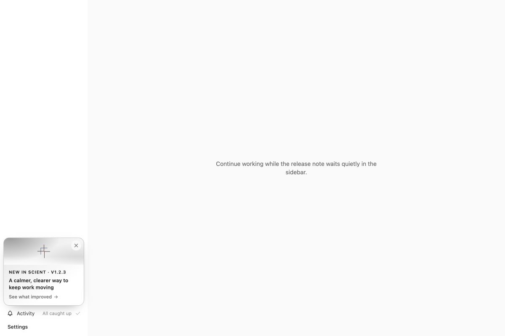
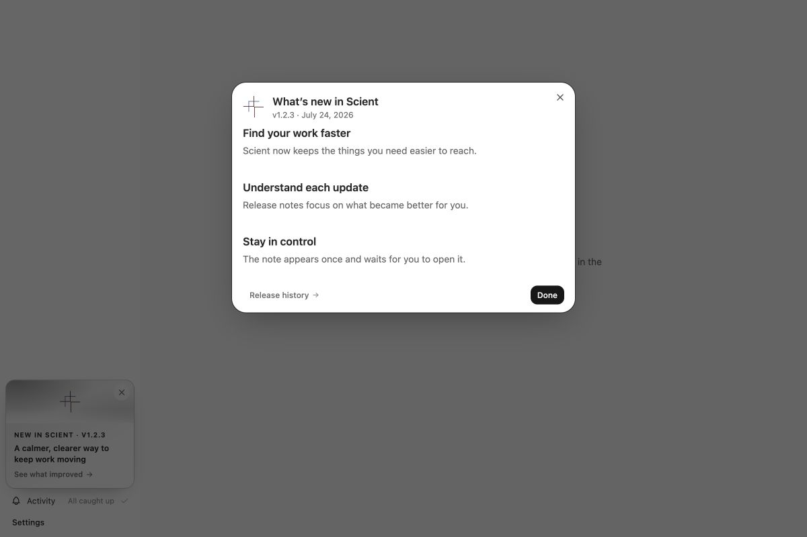
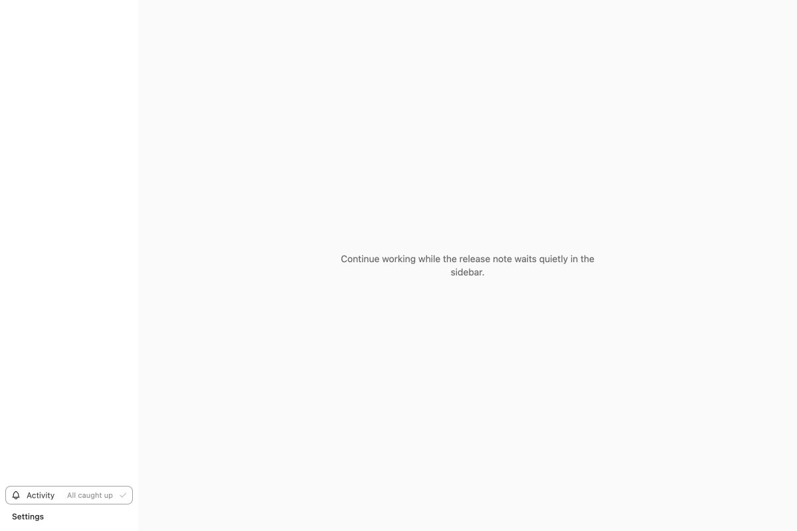
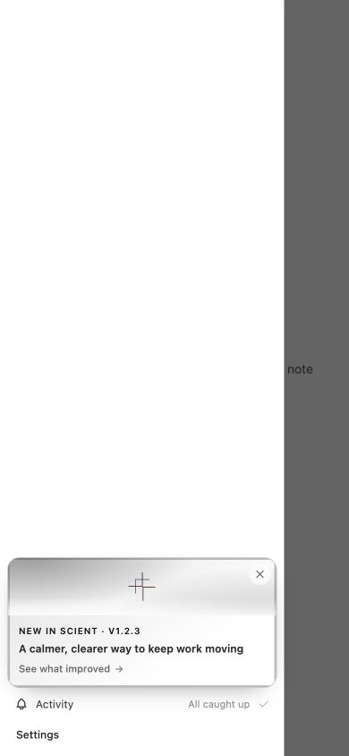
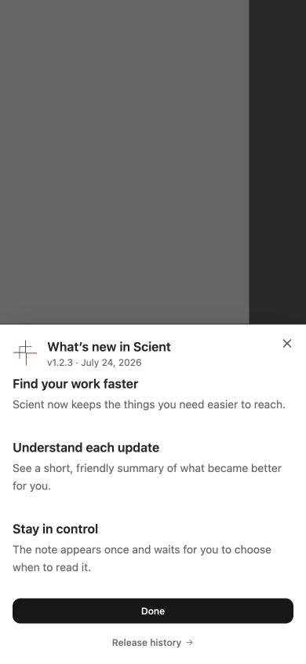
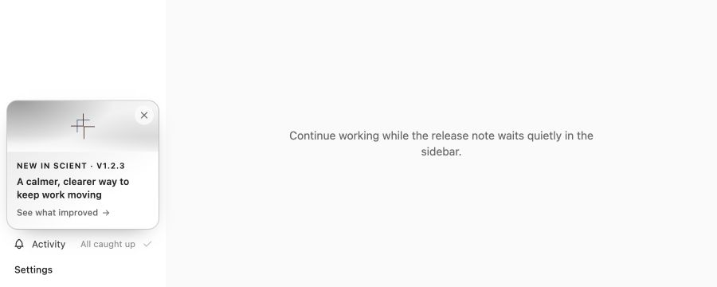
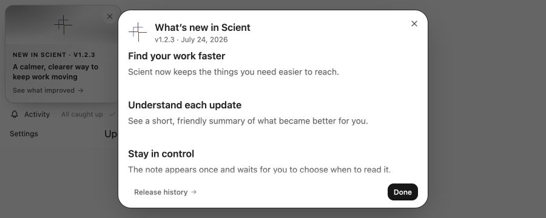

# Scient release-note visual and manual evidence

Captured on 2026-07-24 from the PR branch after merging `origin/main` at
`e6af16d98c503c2b15ba2dff55837a4179a780a0`. The isolated evidence page mounted
the production `WhatsNewProvider`, `WhatsNewSidebarCard`, `SidebarFooterControls`,
`ActivityCenter`, mobile `Sidebar`, and `WhatsNewDialog` components. The page was
removed after capture and is not part of the product diff.

## 1. Desktop card and notification placement

Viewport: 1200 x 800. The 208px sidebar keeps the compact card directly above
Activity and Settings without covering either control or overflowing the footer.

## 2. Full release note

Starting state: the card was visible after a simulated upgrade from 1.2.2 to
1.2.3. Action: activate the card. Observed: a solid, labelled dialog opened only
after the click; focus moved to the dialog heading; the three concise user
benefits and both footer actions remained visible.

## 3. Dismissal and recovery

Action: select **Done**. Observed: the dialog and one-time card disappeared and
keyboard focus returned to Activity, which retained a visible focus outline.

## 4. Mobile and narrow layout

Viewport: 390 x 844. Starting state: the real mobile sidebar Sheet was closed,
so the offscreen card was not consumed. Action: open the sidebar. Observed: the
card filled the Sheet width without horizontal clipping and retained the same
card, Activity, Settings hierarchy.

Action: activate the card from inside the Sheet. Observed after the transition
settled: the release dialog was the topmost modal; focus moved to its heading;
all three standard-release highlights were readable; and the header and actions
remained inside the viewport. Automated acceptance separately closes this nested
path with both Escape and **Done**, verifies that only the topmost dialog closes,
and confirms coherent focus recovery to Activity.

## 5. Short-height layout

Viewport: 900 x 360. The card, Activity state, and Settings remained visible and
usable together without footer scrolling or overlap.

Action: activate the card. Observed: the full three-highlight note stayed within
the viewport; its header and footer remained fixed and reachable while the
middle content panel supplied the bounded scrolling region. The geometry suite
asserts the popup bounds, header/footer containment, and actual panel scrolling.

## 6. Reduced motion

A still image cannot prove motion timing. The focused browser acceptance test
emulates `prefers-reduced-motion: reduce`, opens the dialog through the real card,
and asserts that both the popup and backdrop have a computed transition duration
of `0s`; it then dismisses the dialog and verifies removal. This is repeated in
the full stable browser suite.

## 7. Failure states

The release note uses local catalog data, so it has no runtime loading/network
failure state. Its relevant failure boundary is the release preflight. Manual CLI
proof exercises the exact release command with an unexpected unreferenced leaf in
`apps/web/public/release-notes`; the command fails closed before a native build.
Focused regression tests additionally reject corrupted and truncated PNG data,
unreferenced non-PNG/undecodable files, file and directory symlinks, and a FIFO.

## Evidence limits

These captures prove the release-note components, placement, responsive reflow,
nested-dialog layering, focus result, and visible states in the browser
implementation. Browser console warning/error logs were empty during the added
mobile and short-height dialog captures. They are not a
packaged-updater acceptance test and do not claim that a real release note ships:
the production catalog remains intentionally empty until a release owner approves
the exact release entry.
